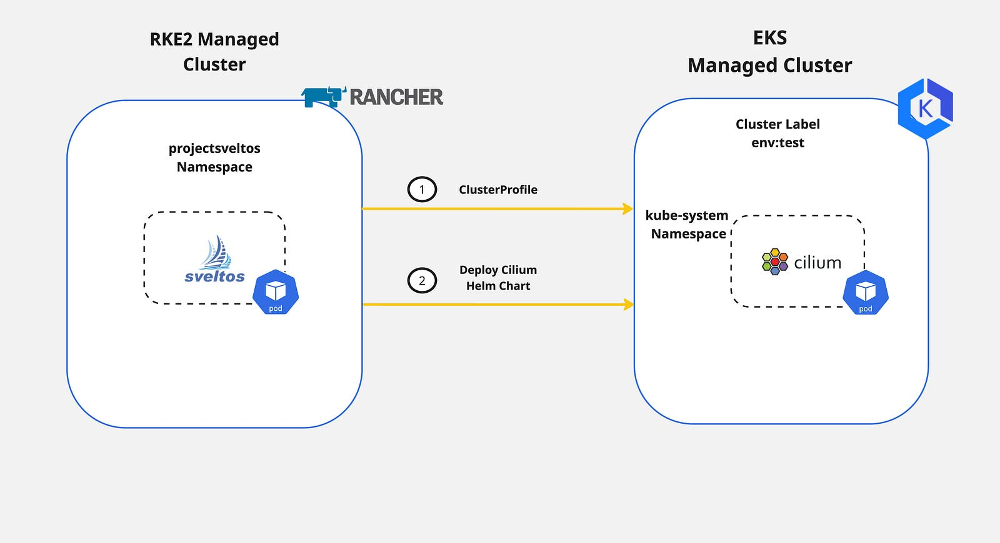

## Introduction

In today's blog post, we will demonstrate an easy way of deploying and controlling [Cilium](https://docs.cilium.io/en/v1.14/) on an [EKS](https://aws.amazon.com/eks/) cluster with [Sveltos](https://github.com/projectsveltos). 

As the majority of the documentation out there provides a step-by-step installation directly with the Helm chart commands, we decided to demonstrate a different approach, the GitOps approach, with the use of [Sveltos ClusterProfile](https://projectsveltos.github.io/sveltos/addons/addons/) CRD (Custom Resource Definition).

<!--truncate-->

We will utilise the Terraform [AWS EKS module](https://registry.terraform.io/modules/terraform-aws-modules/eks/aws/latest) to create an EKS cluster. Once the cluster is up and running, we will register it with Sveltos. Then, we will update the [`aws-core` daemonset](https://docs.aws.amazon.com/eks/latest/userguide/managing-vpc-cni.html) to support  ENI mode and remove the `kube-proxy` Kubernetes resources as Cilium will take over.

## Diagram



## Lab Setup

```bash
+-----------------+-------------------+--------------------------+
|   Cluster Name  |        Type       |         Version          |
+-----------------+-------------------+--------------------------+
|   mgmt          | Management Cluster| RKE2 v1.28.9+rke2r1      |
| eks-test01      | Managed Cluster   | EKS v1.28.10-eks-49c6de4 |
+-----------------+-------------------+--------------------------+

+-------------+----------+
|  Deployment | Version  |
+-------------+----------+
|    Cilium   | v1.14.8  |
|  sveltosctl | v0.27.0  |
+-------------+----------+
```

## Prerequisites

To follow along with the blog post, ensure the below are satisfied.

1. AWS Service Account
1. AWS CLI installed
1. Terraform installed
1. kubectl installed
1. sveltosctl installed

## Step 1: Create EKS Cluster with Terraform

The easiest way to spin up an EKS cluster is by following the recommended training and resources from the Hashicorp website. Find the training material and the Git repository further below.

- Training: https://developer.hashicorp.com/terraform/tutorials/kubernetes/eks

- GitHub Repository: https://github.com/hashicorp/learn-terraform-provision-eks-cluster

To execute the Terraform plan, a valid `AWS Service Account` should be available with the right permissions to create the required resources. For more information about the AWS Service Accounts, have a look [here](https://docs.aws.amazon.com/eks/latest/userguide/iam-roles-for-service-accounts.html).

To get the cluster `kubeconfig` and start interacting with the cluster, the **AWS CLI** is used. Modify and execute the command below.

```bash
$ aws eks update-kubeconfig --region <the region the cluster created> --name <the name of the cluster>
```

:::tip
The command will save the kubeconfig in the default directory `~/.kube/config`. If the file should be stored elsewhere, pass the argument `--kubeconfig` and specify the output directory. For more details, check out the [link](https://docs.aws.amazon.com/cli/latest/reference/eks/update-kubeconfig.html).
:::

## Step 2: Register Cluster with Sveltos

Once we have access to the cluster, it is time to proceed with the Sveltos cluster registration. As this is a cloud Kubernetes cluster, we need to ensure Sveltos has the **right set of permissions** to perform the Kubernetes deployments and add-ons. To do that, we will utilise `sveltosctl` and generate a new kubeconfig file.

### Generate Sveltos kubeconfig

```bash
$ export KUBECONFIG=<directory of the EKS kubeconfig file>

$ sveltosctl generate kubeconfig --create --expirationSeconds=86400
```

The `sveltosctl` command will create a kubeconfig file. The file will be used for the Sveltos cluster registration.

### Register EKS Cluster

```bash
$ sveltosctl register cluster --namespace=<namespace> --cluster=<cluster name> \
    --kubeconfig=<path to Sveltos file with Kubeconfig> \
    --labels=env=test
```

The command above will register the EKS cluster with Sveltos on the mentioned **namespace**, and **name** and will attach the cluster **label** `env=test` defined.

:::note
If the namespace does not exist in the management cluster, the command will fail with the namespace not found error. Ensure the defined namespace exists in the cluster before registration.
:::

```bash
$ export KUBECONFIG=<Sveltos managament cluster> 

$ kubectl get sveltosclusters -A --show-labels
NAMESPACE        NAME         READY   VERSION                LABELS
mgmt             mgmt         true    v1.28.9+rke2r1         sveltos-agent=present
test             eks-test01   true    v1.28.10-eks-49c6de4   env=test,sveltos-agent=present
```

## Step 3: Update the EKS cluster

As we would like to use Cilium with the Kube Proxy replacement and the [ENI](https://docs.aws.amazon.com/AmazonECS/latest/bestpracticesguide/networking-networkmode-awsvpc.html) mode enabled, we need to perform additional actions. As the `kube-proxy` daemonset is already installed, we have to remove all related resources and update the `aws-node` daemonset to support the ENI mode.

### Validation

```bash
$ kubectl get pods,ds -n kube-system
NAME                                      READY   STATUS    RESTARTS   AGE
pod/aws-node-4x8sq                        2/2     Running   0          16m
pod/aws-node-vjtlx                        2/2     Running   0          16m
pod/aws-node-xp7vl                        2/2     Running   0          16m
pod/coredns-648485486-t5sxm               1/1     Running   0          20m
pod/coredns-648485486-tv4h5               1/1     Running   0          20m
pod/ebs-csi-controller-5df9db689f-8hmdm   6/6     Running   0          15m
pod/ebs-csi-controller-5df9db689f-qmxhs   6/6     Running   0          15m
pod/ebs-csi-node-2rspx                    3/3     Running   0          15m
pod/ebs-csi-node-gvtfj                    3/3     Running   0          15m
pod/ebs-csi-node-t96ch                    3/3     Running   0          15m
pod/kube-proxy-4jxlt                      1/1     Running   0          16m
pod/kube-proxy-hgx9h                      1/1     Running   0          16m
pod/kube-proxy-l877x                      1/1     Running   0          16m

NAME                                  DESIRED   CURRENT   READY   UP-TO-DATE   AVAILABLE   NODE SELECTOR              AGE
daemonset.apps/aws-node               3         3         3       3            3           <none>                     20m
daemonset.apps/ebs-csi-node           3         3         3       3            3           kubernetes.io/os=linux     16m
daemonset.apps/ebs-csi-node-windows   0         0         0       0            0           kubernetes.io/os=windows   16m
daemonset.apps/kube-proxy             3         3         3       3            3           <none>                     20m
```

### Delete kube-proxy Resources

```bash
$ export KUBECONFIG=<directory of the EKS kubeconfig file>

$ kubectl delete ds kube-proxy -n kube-system # Remove the kube-proxy daemonset

$ kubectl delete cm kube-proxy -n kube-system # Remove the kube-proxy ConfigMap
```

### Update aws-node Resources

```bash
$ kubectl patch daemonset aws-node --type='strategic' -p='{"spec":{"template":{"spec":{"nodeSelector":{"io.cilium/aws-node-enabled":"true"}}}}}' -n kube-system # This is required based on the Cilium documentation to enable the ENI mode
```

```bash
$ kubectl get pods,ds -n kube-system
NAME                                      READY   STATUS    RESTARTS   AGE
pod/coredns-648485486-t5sxm               1/1     Running   0          22m
pod/coredns-648485486-tv4h5               1/1     Running   0          22m
pod/ebs-csi-controller-5df9db689f-8hmdm   6/6     Running   0          17m
pod/ebs-csi-controller-5df9db689f-qmxhs   6/6     Running   0          17m
pod/ebs-csi-node-2rspx                    3/3     Running   0          17m
pod/ebs-csi-node-gvtfj                    3/3     Running   0          17m
pod/ebs-csi-node-t96ch                    3/3     Running   0          17m

NAME                                  DESIRED   CURRENT   READY   UP-TO-DATE   AVAILABLE   NODE SELECTOR                     AGE
daemonset.apps/aws-node               0         0         0       0            0           io.cilium/aws-node-enabled=true   22m
daemonset.apps/ebs-csi-node           3         3         3       3            3           kubernetes.io/os=linux            17m
daemonset.apps/ebs-csi-node-windows   0         0         0       0            0           kubernetes.io/os=windows          17m
```

:::tip
The aws-node daemonset scaled down to 0 replicas.
:::

### Step 4: Create Sveltos ClusterProfile

It is time to create a **Sveltos ClusterProfile** and deploy **Cilium** to the EKS cluster with the label set to `env=test`. Following the Cilium [documentation](https://docs.cilium.io/en/v1.14/installation/k8s-install-helm/), we will enable the required Helm values for the `kube-proxy `replacement and the ENI mode.

```yaml
---
apiVersion: config.projectsveltos.io/v1alpha1
kind: ClusterProfile
metadata:
  name: cilium-1148
spec:
  clusterSelector: env=test # Deploy Cilium v1.14.8 to any cluster with the cluster label set to env=test
  helmCharts:
  - chartName: cilium/cilium
    chartVersion: 1.14.8
    helmChartAction: Install
    releaseName: cilium
    releaseNamespace: kube-system
    repositoryName: cilium
    repositoryURL: https://helm.cilium.io/
    values: |
      eni:
        enabled: true
      ipam:
        mode: eni
      egressMasqueradeInterfaces: eth0
      routingMode: native
      kubeProxyReplacement: true
      k8sServiceHost: <The Server API FQDN or IP Address> # The information can be exctracted from the kubeconfig file or the AWS UI
      k8sServicePort: <The Server API listening port> # The information can be extracted from the kubeconfig file or the AWS UI
      nodePort:
        enabled: true
      debug:
        enabled: true
```

The ClusterProfile will deploy Cilium CNI to any cluster with the cluster label set to `env=test`. It will then deploy the Cilium Helm chart in the `kube-system` namespace alongside the kube-proxy replacement and the ENI mode. Hubble is also enabled.

## Step 5: Deploy Cilium and Validate

To see and evaluate the results, the Sveltos ClusterProfile will be deployed to the management cluster.

```bash
$ export KUBECONFIG=<Sveltos managament cluster>

$ kubectl apply -f "clusterprofile_cilium1148.yaml"
```

### Validation

```bash
$ ./sveltosctl show addons
+-----------------+---------------+-------------+--------+---------+-------------------------------+----------------------------+
|     CLUSTER     | RESOURCE TYPE |  NAMESPACE  |  NAME  | VERSION |             TIME              |          PROFILES          |
+-----------------+---------------+-------------+--------+---------+-------------------------------+----------------------------+
| test/eks-test01 | helm chart    | kube-system | cilium | 1.14.8  | 2024-06-18 14:39:26 +0000 UTC | ClusterProfile/cilium-1148 |
+-----------------+---------------+-------------+--------+---------+-------------------------------+----------------------------+
```

```bash
$ export KUBECONFIG=<directory of the EKS kubeconfig file>

$ kubectl get pods -n kube-system | grep -i cilium
cilium-2vg4c                          1/1     Running             0          54s
cilium-operator-594f4858f6-km2wh      1/1     Running             0          54s
cilium-operator-594f4858f6-xx2q6      1/1     Running             0          55s
cilium-qrwwf                          1/1     Running             0          55s
cilium-s55v5                          1/1     Running             0          54s
```

```bash
$ kubectl exec -it cilium-2vg4c -n kube-system -- cilium status
Defaulted container "cilium-agent" out of: cilium-agent, config (init), mount-cgroup (init), apply-sysctl-overwrites (init), mount-bpf-fs (init), clean-cilium-state (init), install-cni-binaries (init)
KVStore:                 Ok   Disabled
Kubernetes:              Ok   1.28+ (v1.28.10-eks-49c6de4) [linux/amd64]
Kubernetes APIs:         ["EndpointSliceOrEndpoint", "cilium/v2::CiliumClusterwideNetworkPolicy", "cilium/v2::CiliumEndpoint", "cilium/v2::CiliumNetworkPolicy", "cilium/v2::CiliumNode", "cilium/v2alpha1::CiliumCIDRGroup", "core/v1::Namespace", "core/v1::Pods", "core/v1::Service", "networking.k8s.io/v1::NetworkPolicy"]
KubeProxyReplacement:    True   [eth0 10.0.1.150 (Direct Routing), eth1 10.0.1.37]
```

### Deploy Nginx Application

```bash
$ kubectl apply -f "nginx.yaml"

$ kubectl get pods,svc
NAME                            READY   STATUS    RESTARTS   AGE
pod/my-nginx-684dd4dcd4-gl9rm   1/1     Running   0          18s
pod/my-nginx-684dd4dcd4-nk9mm   1/1     Running   0          18s

NAME                 TYPE        CLUSTER-IP      EXTERNAL-IP   PORT(S)        AGE
service/kubernetes   ClusterIP   172.20.0.1      <none>        443/TCP        33m
service/my-nginx     NodePort    172.20.80.220   <none>        80:32449/TCP   3s
```

### Cilium Validation

```bash
$ kubectl -n kube-system exec ds/cilium -- cilium service list
Defaulted container "cilium-agent" out of: cilium-agent, config (init), mount-cgroup (init), apply-sysctl-overwrites (init), mount-bpf-fs (init), clean-cilium-state (init), install-cni-binaries (init)
ID   Frontend             Service Type   Backend                         
1    172.20.0.1:443       ClusterIP      1 => 10.0.1.15:443 (active)     
                                         2 => 10.0.2.226:443 (active)    
2    172.20.208.197:443   ClusterIP      1 => 10.0.1.150:4244 (active)   
3    172.20.22.66:80      ClusterIP      1 => 10.0.3.36:4245 (active)    
4    172.20.141.67:80     ClusterIP      1 => 10.0.2.229:8081 (active)   
5    172.20.0.10:53       ClusterIP      1 => 10.0.1.144:53 (active)     
                                         2 => 10.0.3.123:53 (active)     
6    172.20.80.220:80     ClusterIP      1 => 10.0.1.216:80 (active)     
                                         2 => 10.0.3.39:80 (active)      
7    10.0.1.150:32449     NodePort       1 => 10.0.1.216:80 (active)     
                                         2 => 10.0.3.39:80 (active)      
8    10.0.1.37:32449      NodePort       1 => 10.0.1.216:80 (active)     
                                         2 => 10.0.3.39:80 (active)      
9    0.0.0.0:32449        NodePort       1 => 10.0.1.216:80 (active)     
                                         2 => 10.0.3.39:80 (active)
```

From the output above, we can observe that Cilium eBPF kube-proxy replacement created the NodePort service for Nginx.

As the blog post is not intended to outline in depth how the kube-proxy replacement works, check out the [link](https://docs.cilium.io/en/v1.14/network/kubernetes/kubeproxy-free/) for further tests.

## Conclusions

We demonstrated an easy way of deploying Cilium CNI to an EKS cluster with the Sveltos ClusterProfile. The complete lifecycle of the CNI is now controlled by Sveltos and without external dependencies.

Take advantage of the [Sveltos Templating](https://projectsveltos.github.io/sveltos/template/intro_template/) and the [Sveltos Event Framework](https://projectsveltos.github.io/sveltos/events/addon_event_deployment/) capabilities to make every Kubernetes deployment and add-on easier!

## Contact

We are here to help! Whether you have questions, or issues or need assistance, our Slack channel is the perfect place for you. Click here to [join us](https://app.slack.com/client/T0471SNT5CZ/C06UZCXQLGP) us.

## 👏 Support this project

Every contribution counts! If you enjoyed this article, check out the Projectsveltos [GitHub repo](https://github.com/projectsveltos). You can [star 🌟 the project](https://github.com/projectsveltos) if you find it helpful.

The GitHub repo is a great resource for getting started with the project. It contains the code, documentation, and many more examples.

Thanks for reading!