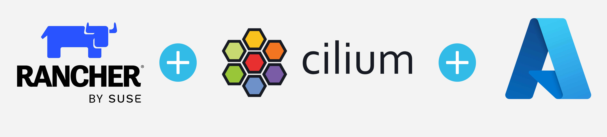

## Introduction

The last couple of days I have been working on a new use case installing [RKE2](https://docs.rke2.io/) clusters powered with [Cilium](https://docs.cilium.io/en/v1.15/) on [Azure cloud](https://azure.microsoft.com/en-us/get-started). The requirement at hand was to use a [Rancher](https://ranchermanager.docs.rancher.com/v2.8) instance and from there start deploying RKE2 clusters. After going through the official Rancher documentation, I have noticed that the instructions provided to pre-configure [Azure cloud](https://ranchermanager.docs.rancher.com/v2.8/how-to-guides/new-user-guides/launch-kubernetes-with-rancher/use-new-nodes-in-an-infra-provider/create-an-azure-cluster) are outdated.

In today's blog post, we will cover all the required steps taken to configure the [Azure cloud free credits](https://azure.microsoft.com/en-us/free#all-free-services) to deploy RKE2 clusters with Cilium on that environment. Additionally, we will cover any limitations come with the `free credit` concept.



<!--truncate-->

## Lab Setup

```bash
+-----------------------------+------------------+----------------------+
|        Cluster Name         |       Type       |       Version        |
+-----------------------------+------------------+----------------------+
|          Rancher            |   k3s cluster    |    v1.28.7+k3s1      |
| Downstream RKE2 cluster     |       RKE2       |  v1.28.11+rke2r1     |
+-----------------------------+------------------+----------------------+

+-------------------+----------+
|    Deployment     | Version  |
+-------------------+----------+
|      Cilium       | 1.15.500 |
+-------------------+----------+

```

## Prerequisites

### Rancher Server

For this demonstration, we do not concetrate on installing Rancher. If you are not sure how to install Rancher, have a look at the official documentation [here]https://ranchermanager.docs.rancher.com/getting-started/quick-start-guides) or go through the guide I created a couple of weeks back [here](https://medium.com/@eleni.grosdouli/rancher-on-eks-with-nginx-ingress-and-lets-encrypt-4f041fc1adae). 

### Azure Free Credits

For this demonstration, I have decided to use the Azure [free credits](https://azure.microsoft.com/en-us/free) offering. This approach will be more than enough to give a good understanding on how to setup the Azure cloud environment to perform RKE2 deployments with Rancher.

### Resources

Ensure the below are satisfied.

1. Helm CLI installed (Optional Step)
1. kubectl installed

## Set up Azure Cloud Environment

In this section, we will provide readers all the needed guidance on setting up their environment for the RKE2 deployment

### Retrieve the Tenant ID

The `Tenant ID` identifies which Azure Active Directory (AD) instance the application sits under. To retrieve the tenand ID, follow the steps below.

1. Login to Azure [portal](https://portal.azure.com/)
1. Navigate to **Home**
1. Search for `Microsoft Entra ID`
  
1. Navigate to **Manage > Properties**
1. Grab the `Tenant ID` once the new windows appears

### Create a Rancher App Registration

Azure App Registration is the process of registering an application with Azure AD.

1. Access the Azure [portal](https://portal.azure.com/) 
1. Navigate to **Home > App registrations > + New Registration**
1. Choose the below details:
    - `Name`: What is the name your application will have
    - `Supported account types`: In my case, I chose the first one, "Accounts in this organizational directory only (Default Directory only - Single tenant)"
    - `Redirect URI (optional)`: set `Web` and left the `Sign-on URL` empty or add your own URI
1. Click the **"Register"** button to create the application

    

### Create an Azure Client Secret for App Registration

1. Access the Azure [portal](https://portal.azure.com/)  
1. Navigate to **Home > App registrations > App name**
1. Navigate to **Manage > Certificates & secrets**
  
1. Click on the **"+ New client secret"**
1. Provide a `description` and an `expiry date`
1. Click **+ Add**
1. Copy the `Value` and proceed with the configuraition

### Create App Registration Permissions

1. Access the Azure [portal](https://portal.azure.com/) 
1. Navigate to **Home > Subscriptions > Your subscription name > Access Control (IAM)**
1. Click on the **+ Add > Add role assigment**
1. Open the `Privileged administrator roles` tab
1. For Role, select `Contributor`
1. Click on **"Next"**
1. Members and "+ Select members" and then choose or type for "Rancher". If your application name is something else, provide the application name created in a previous step 
1. **Review + assing**
1. Proceed with the creation

## Set up Rancher Cloud Credentials
RKE2 comes with its own Cilium CNI Helm chart. That means RKE2 clusters will have an RKE2 Cilium Helm chart deployment in the `kube-system` namespace.

## Create an RKE2 cluster with Cilium

## Limitations


## Conclusions

This is it! We performed a Cilium cluster mesh between two on-prem RKE2 clusters in just a few steps! 🎉

It's a wrap for this post! 🎉 Thanks for reading! Stay tuned for more exciting updates!