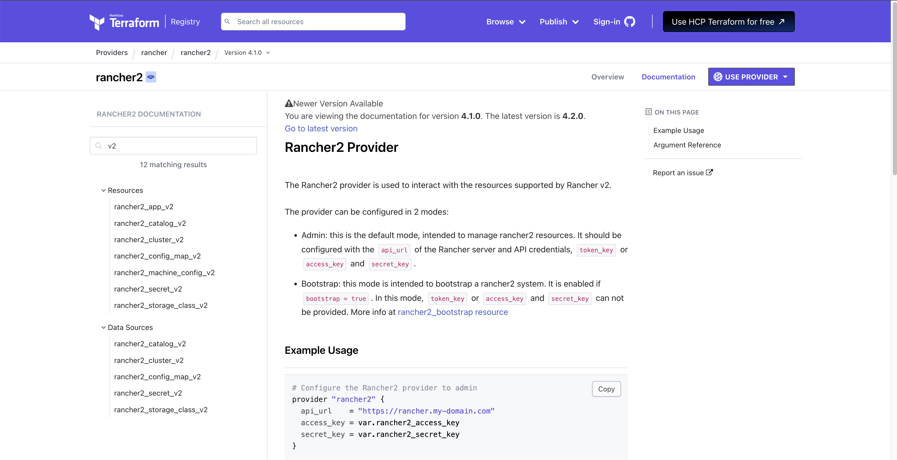

## Introduction

In a [previous post](../2024-07-26-rancher-rke2-azure/rancher-rke2-cilium-azure.md), we covered how to create an [RKE2](https://docs.rke2.io/) cluster on [Azure Cloud](https://azure.microsoft.com/en-us/get-started) using the [cloud-free credits](https://azure.microsoft.com/en-us/free#all-free-services) from the **Rancher UI**. As this is a convenient approach to get started with Rancher, in today's post we will demonstrate how to use [OpenTofu](https://opentofu.org/) to automate the deployment.

`OpenTofu` is a fork of [Terraform](https://www.terraform.io/). It is an open source project, community-driven, and managed by the Linux Foundation. If you want to get familiar with what `OpenTofu` is and how to get started, check out the link [here](https://opentofu.org/docs/intro/core-workflow/).

Additionally, we will demonstrate how easy it is to customise the [Cilium](https://docs.cilium.io/en/stable/) configuration and enable [kube-vip](https://kube-vip.io/) for LoadBalancer services from the HCL (HashiCorp Configuration Language) code definition.
<!--truncate-->

## Lab Setup

```bash
+-----------------------------+------------------+----------------------+
|        Cluster Name         |       Type       |       Version        |
+-----------------------------+------------------+----------------------+
|          Rancher            |   k3s cluster    |    v1.28.7+k3s1      |
| Downstream RKE2 cluster     |       RKE2       |  v1.28.11+rke2r1     |
+-----------------------------+------------------+----------------------+

+-------------------+----------+
|    Deployment     | Version  |
+-------------------+----------+
|      Cilium       | 1.15.500 |
+-------------------+----------+

```

## Prerequisites

### Rancher Server

We do not concentrate on installing `Rancher`. If you are not sure how to install Rancher, have a look at the official documentation [here](https://ranchermanager.docs.rancher.com/getting-started/quick-start-guides) or go through the guide I created a couple of weeks back found [here](https://medium.com/@eleni.grosdouli/rancher-on-eks-with-nginx-ingress-and-lets-encrypt-4f041fc1adae). 

### Azure Free Credits

For this demonstration, we will use the Azure [free credits](https://azure.microsoft.com/en-us/free) offering. The approach taken is more than enough to provide readers with a good understanding of how to set up the Azure cloud environment to perform RKE2 deployments with Rancher without spending money for the deployment.

Ensure the below are satisfied.

1. Helm CLI installed (Optional Step)
1. kubectl installed

### Install OpenTofu

There is a wide variety of options provided to install `OpenTofu`. To follow along, checkout the [link](https://opentofu.org/docs/intro/install/) and install `OpenTofu`.

#### Validation

```bash
$ tofu version
OpenTofu v1.8.1
on darwin_arm64
```

## Step 0: Pre-work

### Step 0.1: Familirize with OpenTofu Registry

As with the Terraform registry, the `OpenTofu` registry is a centralised service for **distributing** and **managing** providers/modules. Users can **share**, **discover**, and **consume** reusable infrastructure modules and providers.

A list of the available providers/modules is located [here](https://github.com/opentofu/registry/).

For our demonstration, we identified the `rancher2` provider is supported by OpenTofu. The details can be found [here](https://github.com/opentofu/registry/tree/main/providers/r/rancher).


### Step 0.2: Familiarize with Rancher2 Provider

Before we even begin with the actual coding, it is a nice opportunity to familiarise with the [Rancher2 provider](https://registry.terraform.io/providers/rancher/rancher2/4.1.0/docs). For RKE2 clusters, we only care about the `Resources` and `Data Resources` with the extention of `v2` at the end.

    

:::tip
Check out the example sections of the resources available and the different Cloud providers supported.
:::

### Step 0.3: Choose Integrated Development Environment (IDE)

As with any other project, we will use [Git](https://git-scm.com/book/en/v2/Getting-Started-What-is-Git%3F) to store our code in a central location and [Visual Studio Code](https://code.visualstudio.com/) to perform the coding. Choose your favourite source control system and IDE, and let's dive into the next sections! :)

## Outline Project Structure

Like with any Terraform project, we will create a number of `.tf` to store the Infrastructure as Code (IaC) definitions. For best practices, have a look at the [link](https://spacelift.io/blog/opentofu-tutorial#opentofu-best-practices).

In your favourite IDE, create a new project and slowly start populating the below file structure.

### File structure

- `cluster.tf`: Contains the resource blocks that define the resources to be created in Azure cloud
- `variables.tf`: Contains the variable declaration used in the resource blocks
- `providers.tf`: Contains the required providers used in the resource blocks
- `data.tf`: Contains a number of data retrived from the outside and use it through the resource creation
- `output.tf`: Contains the output that needs to be generated on successful completion of the OpenTofu plan/apply
- `*.tfvars`: Contains the environment-specific default values of variables.

## providers.tf

As mentioned above, the `providers.tf` file holds the required providers that will be used for the creation of the relevant resources. OpenTofu configurations must declare which providers they require so that OpenTofu can install and use them.

```hcl
terraform {

  required_providers {
    rancher2 = {
      source  = "rancher/rancher2"
      version = "4.1.0"
    }

    local = {
      source  = "hashicorp/local"
      version = "2.5.1"
    }
  }
}

provider "rancher2" {
  api_url   = var.rancher2_api_url
  token_key = var.rancher2_token_key
  insecure  = true
}
```

:::tip
It is a good practice to avoid specifying sensitive data in the `variables.tf` file. From the `providers.tf` definition we can see the `rancher2_api_url` and `rancher2_token_key` should be provided as variables. We can have a file with the required information, export the variable name and values and use them by setting the [source](https://www.digitalocean.com/community/tutorials/how-to-read-and-set-environmental-and-shell-variables-on-linux) pointing to the file before performing any IaC actions.
:::

:::note
The `required_providers` block is used to specify and configure the providers necessary for a particular module or configuration. Before we define the `rancher2` provider block, we need to ensure it is included in the `required_providers` section. It is a good practice to befine the provider versions instead of letting `OpenTofu` CLI to download the latest available. More information can be found [here](https://opentofu.org/docs/language/providers/configuration/).
:::

## data.tf

The `data.tf` file holds the code to downlod relevant information about the kube-vip installation. The information will be used later on in the `cluster.tf` file while defining the the RKE2 cluster configuration.

```hcl
# Download the kube-vip required RBAC manisfest
data "http" "kube_vip_rbac" {
  url = "https://kube-vip.io/manifests/rbac.yaml"
}

# Download a specific kube-vip version
data "http" "kube_vip_version" {
  method = "GET"
  url    = "https://api.github.com/repos/kube-vip/kube-vip/releases#v0.8.2"
}

# Download the kube-vip-cloud-provider required manisfest
data "http" "kube_vip_cloud_provider" {
  url = "https://raw.githubusercontent.com/kube-vip/kube-vip-cloud-provider/main/manifest/kube-vip-cloud-controller.yaml"
}

# Get the system-id from the Rancher server
data "rancher2_namespace" "kube_system" {
  name       = "kube-system"
  project_id = data.rancher2_project.system.id
}

# Get the cluster-id from from the Rancher server
data "rancher2_project" "system" {
  name       = "System"
  cluster_id = rancher2_cluster_v2.rke2.cluster_v1_id
}
```

## output.tf

In the file we can speficy anything we want based on the use case at hand. For this demonmstration, let's keep it simple. We would only display to the console the RKE2 `cluster-name` and `cluster-id`.

```hcl
# Display the RKE2 Cluster Name
output "rke2_cluster_name" {
  value = rancher2_cluster_v2.rke2.name
}

# Display the RKE2 Cluster ID
output "rancher_cluster_id" {
  value = data.rancher2_project.system.cluster_id
}
```

## cluster.tf

```hcl
# Random ID to be appended to the node creation
resource "random_id" "cluster_random_name" {
  byte_length = 3
}

# Create the Azure Cloud Credentials in Rancher
resource "rancher2_cloud_credential" "azure_creds" {
  name = "Azure Credentials"
  azure_credential_config {
    client_id       = var.azure_env.az_client_id
    client_secret   = var.azure_env.az_client_secret
    subscription_id = var.azure_env.az_subscription_id
  }
}

# Create the different nodes for RKE2 (control-plane and worker node)
resource "rancher2_machine_config_v2" "nodes" {
  for_each      = var.node
  generate_name = replace(each.value.name, "_", "-")

  azure_config {
    disk_size            = each.value.agent_disk
    image                = each.value.image
    location             = each.value.location
    managed_disks        = true
    open_port            = each.value.open_port
    private_address_only = false
    resource_group       = each.value.resource_group
    storage_type         = each.value.storage_type
    size                 = each.value.agent_type
  }
}

# RKE2 configuration
resource "rancher2_cluster_v2" "rke2" {
  # for_each = var.kube_vip
  annotations           = var.rancher_env.cluster_annotations
  kubernetes_version    = var.rancher_env.rke2_version
  labels                = var.rancher_env.cluster_labels
  enable_network_policy = var.rancher_env.network_policy # Option to enable or disable Project Network Isolation.
  name                  = var.rancher_env.cluster_id

  rke_config {
    additional_manifest = templatefile("${path.module}/files/kube-vip-daemonset-original.tfmpl",
      {
        int_name                = var.kube_vip.int_name
        kube_vip_rbac           = data.http.kube_vip_rbac.response_body
        kube_vip_version        = jsondecode(data.http.kube_vip_version.response_body)[0]["tag_name"]
        kube_vip_address        = var.kube_vip.kube_vip_address
        kube_vip_pool           = var.kube_vip.kube_vip_pool
        kube_vip_cloud_provider = data.http.kube_vip_cloud_provider.response_body
    })

    chart_values = <<-EOF
      rke2-cilium:
        k8sServiceHost: 127.0.0.1
        k8sServicePort: 6443
        kubeProxyReplacement: true
        operator:
          replicas: 1
        hubble:
          enabled: true
          peerService:
            clusterDomain: cluster.local
          relay:
            enabled: true
          tls:
            auto:
              certValidityDuration: 1095
              enabled: true
              method: helm
          ui:
            enabled: true
      EOF

    machine_global_config = <<EOF
      cni: "cilium"
      cluster-cidr: ${var.rke_cluster_cidr}
      service-cidr: ${var.rke_service_cidr}
      disable-kube-proxy: true
      etcd-expose-metrics: false
      EOF

    dynamic "machine_pools" {
      for_each = var.node
      content {
        cloud_credential_secret_name = rancher2_cloud_credential.azure_creds.id
        control_plane_role           = machine_pools.key == "ctl_plane" ? true : false
        etcd_role                    = machine_pools.key == "ctl_plane" ? true : false
        name                         = machine_pools.value.name
        quantity                     = machine_pools.value.quantity
        worker_role                  = machine_pools.key != "ctl_plane" ? true : false

        machine_config {
          kind = rancher2_machine_config_v2.nodes[machine_pools.key].kind
          name = replace(rancher2_machine_config_v2.nodes[machine_pools.key].name, "_", "-")
        }
      }
    }

    machine_selector_config {
      config = null
    }

  }
```

## variables.tf

Outline how the variables used in the `cluster.tf` file should look like. If required, perform additional validations to the code.

```hcl
variable "azure_env" {
  description = "Azure required details"
  type = object({
    az_client_id       = string
    az_client_secret   = string
    az_subscription_id = string
  })
}

variable "kube_vip" {
  description = "kube-vip basic settings"
  type = object({
    int_name         = string
    kube_vip_address = string
    kube_vip_pool    = string
  })
}

variable "node" {
  description = "Two RKE2 nodes to be configured"
  type = object({
    ctl_plane = object({
      name           = string
      agent_disk     = optional(number)
      image          = optional(string)
      location       = optional(string)
      open_port      = optional(list(string))
      resource_group = optional(string)
      storage_type   = optional(string)
      agent_type     = optional(string)
      quantity       = number
    })
    worker = object({
      name           = string
      agent_disk     = optional(number)
      image          = optional(string)
      location       = optional(string)
      open_port      = optional(list(string))
      resource_group = optional(string)
      storage_type   = optional(string)
      agent_type     = optional(string)
      quantity       = number
    })
  })
}

variable "rancher2_api_url" {
  description = "URL to Rancher Server API"
  type        = string
}

variable "rancher2_token_key" {
  description = "Rancher API Token key"
  type        = string
}

variable "rke2_ssh_public_key" {
  description = "RKE2 cluster SSH public key"
  type        = string
}

variable "rancher_env" {
  description = "Rancher environment needed variables"
  type = object({
    cluster_annotations = map(string)
    cluster_labels      = map(string)
    rke2_version        = string
    cluster_id          = string
    network_policy      = bool
  })
}

variable "rke_cluster_cidr" {
  description = "RKE2 cluster CIDR prefix"
  type        = string
}

variable "rke_service_cidr" {
  description = "RKE2 service CIDR prefix"
  type        = string
}

```

## ✉️ Contact

If you have any questions, feel free to get in touch! You can use the `Discussions` option found [here](https://github.com/egrosdou01/personal-blog/discussions) or reach out to me on any of the social media platforms provided. 😊

We look forward to hearing from you!

## Conclusions

This is it! We performed a Cilium cluster mesh between two on-prem RKE2 clusters in just a few steps! 🎉

It's a wrap for this post! 🎉 Thanks for reading! Stay tuned for more exciting updates!