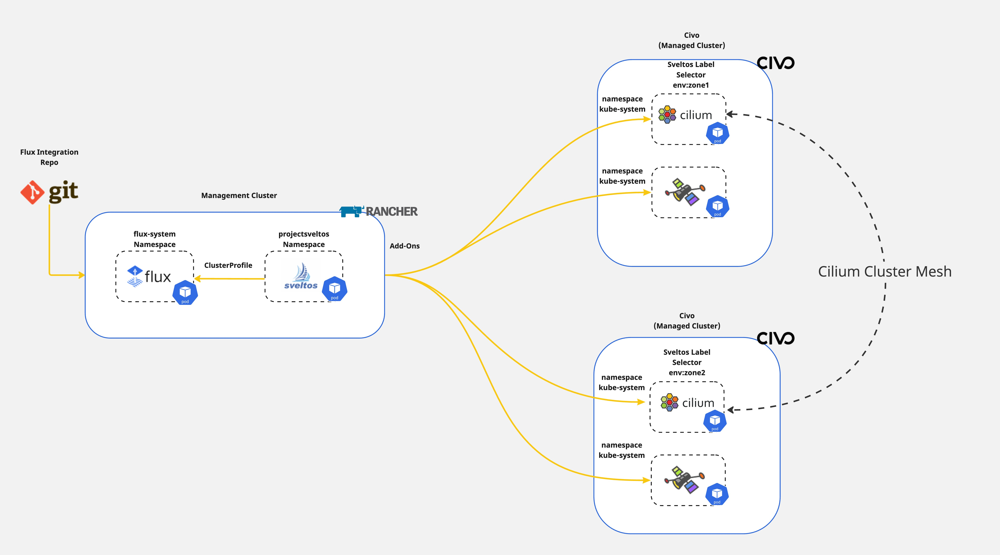

## Introduction

Have you ever wondered how to dynamically instantiate Kubernetes resources before deploying them to a cluster? What if I tell you there is an easy way to do it. Sveltos lets you define add-ons and applications using [templates](https://projectsveltos.github.io/sveltos/template/intro_template/). Before deploying any resource down the **managed** clusters, Sveltos instantiates the templates using information gathered from the **management** cluster.

In todays blog post I will like to demonstrate how to create a Cilium cluster mesh between two clusters using the Sveltos templating feature to instantiate the Cilium helm chart definition.



<!--truncate-->


## Lab Setup

```bash
+-----------------+-------------------+--------------------------+
|   Cluster Name  |        Type       |         Version          |
+-----------------+-------------------+--------------------------+
|   mgmt          | Management Cluster| RKE2 v1.28.9+rke2r1      |
|  mesh01         | Managed Cluster   | k3s v1.29.2-eks-49c6de4  |
|  mesh02         | Managed Cluster   | k3s v1.29.2-eks-49c6de4  |
+-----------------+-------------------+--------------------------+

+-------------+----------+
|  Deployment | Version  |
+-------------+----------+
|    Cilium   | v1.15.6  |
|  sveltosctl | v0.27.0  |
+-------------+----------+
```

## Prerequisites

To follow along with the blog post, ensure the below are satisfied.

1. AWS Service Account
1. AWS CLI installed
1. Terraform installed
1. kubectl installed
1. sveltosctl installed

## Step 1: Create EKS Cluster with Terraform

The easiest way to spin up an EKS cluster is by following the recommended training and resources from the Hashicorp website. Find the training material and the Git repository further below.

- Training: https://developer.hashicorp.com/terraform/tutorials/kubernetes/eks

- GitHub Repository: https://github.com/hashicorp/learn-terraform-provision-eks-cluster

To execute the Terraform plan, a valid `AWS Service Account` should be available with the right permissions to create the required resources. For more information about the AWS Service Accounts, have a look [here](https://docs.aws.amazon.com/eks/latest/userguide/iam-roles-for-service-accounts.html).

To get the cluster `kubeconfig` and start interacting with the cluster, the **AWS CLI** is used. Modify and execute the command below.

```bash
$ aws eks update-kubeconfig --region <the region the cluster created> --name <the name of the cluster>
```

:::tip
The command will save the kubeconfig in the default directory `~/.kube/config`. If the file should be stored elsewhere, pass the argument `--kubeconfig` and specify the output directory. For more details, check out the [link](https://docs.aws.amazon.com/cli/latest/reference/eks/update-kubeconfig.html).
:::

## Step 2: Register Cluster with Sveltos

Once we have access to the cluster, it is time to proceed with the Sveltos cluster registration. As this is a cloud Kubernetes cluster, we need to ensure Sveltos has the **right set of permissions** to perform the Kubernetes deployments and add-ons. To do that, we will utilise `sveltosctl` and generate a new kubeconfig file.

### Generate Sveltos kubeconfig

```bash
$ export KUBECONFIG=<directory of the EKS kubeconfig file>

$ sveltosctl generate kubeconfig --create --expirationSeconds=86400
```

The `sveltosctl` command will create a kubeconfig file. The file will be used for the Sveltos cluster registration.

### Register EKS Cluster

```bash
$ sveltosctl register cluster --namespace=<namespace> --cluster=<cluster name> \
    --kubeconfig=<path to Sveltos file with Kubeconfig> \
    --labels=env=test
```

The command above will register the EKS cluster with Sveltos on the mentioned **namespace**, and **name** and will attach the cluster **label** `env=test` defined.

:::note
If the namespace does not exist in the management cluster, the command will fail with the namespace not found error. Ensure the defined namespace exists in the cluster before registration.
:::

```bash
$ export KUBECONFIG=<Sveltos managament cluster> 

$ kubectl get sveltosclusters -A --show-labels
NAMESPACE        NAME         READY   VERSION                LABELS
mgmt             mgmt         true    v1.28.9+rke2r1         sveltos-agent=present
test             eks-test01   true    v1.28.10-eks-49c6de4   env=test,sveltos-agent=present
```


## Conclusions

We demonstrated an easy way of deploying Cilium CNI to an EKS cluster with the Sveltos ClusterProfile. The complete lifecycle of the CNI is now controlled by Sveltos and without external dependencies.

Take advantage of the [Sveltos Templating](https://projectsveltos.github.io/sveltos/template/intro_template/) and the [Sveltos Event Framework](https://projectsveltos.github.io/sveltos/events/addon_event_deployment/) capabilities to make every Kubernetes deployment and add-on easier!

## ✉️ Contact

We are here to help! Whether you have questions, or issues or need assistance, our Slack channel is the perfect place for you. Click here to [join us](https://app.slack.com/client/T0471SNT5CZ/C06UZCXQLGP) us.

## 👏 Support this project

Every contribution counts! If you enjoyed this article, check out the Projectsveltos [GitHub repo](https://github.com/projectsveltos). You can [star 🌟 the project](https://github.com/projectsveltos) if you find it helpful.

The GitHub repo is a great resource for getting started with the project. It contains the code, documentation, and many more examples.

Thanks for reading!