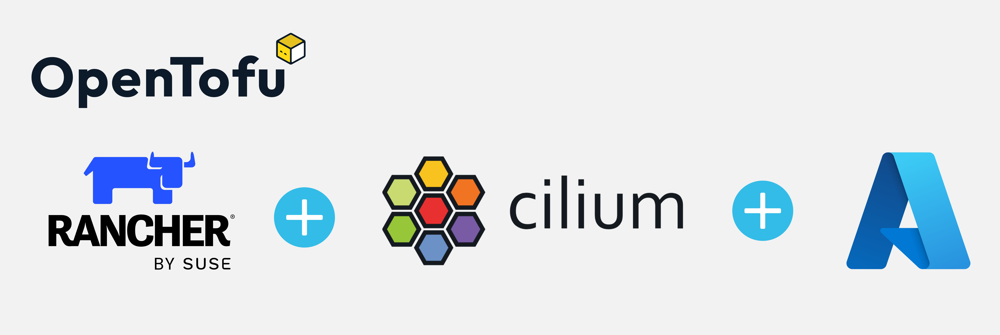
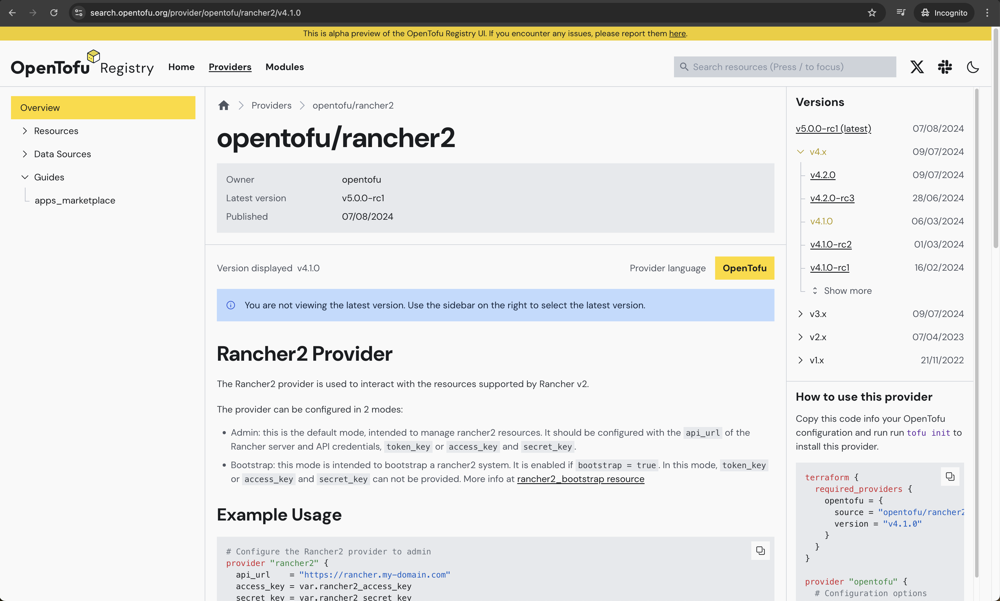
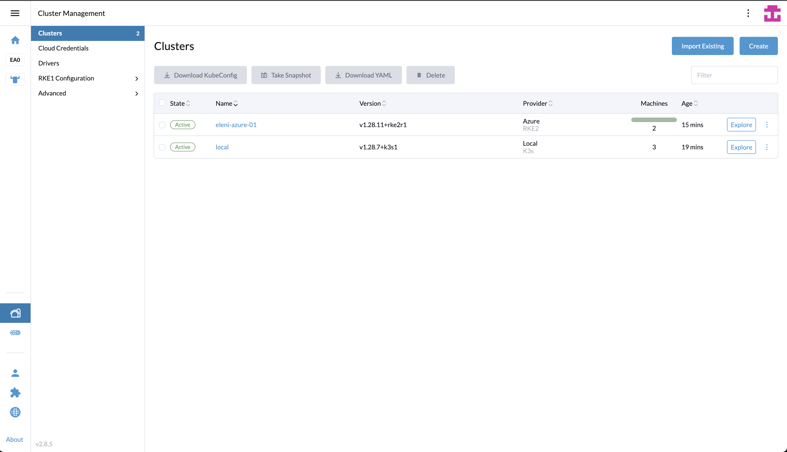

## Introduction

In a [previous post](../2024-07-26-rancher-rke2-azure/rancher-rke2-cilium-azure.md), we covered how to create an [RKE2](https://docs.rke2.io/) cluster on [Azure Cloud](https://azure.microsoft.com/en-us/get-started) using the [cloud-free credits](https://azure.microsoft.com/en-us/free#all-free-services) from the **Rancher UI**. As this is a convenient approach to get started with Rancher, in today's post, we will demonstrate how to use [OpenTofu](https://opentofu.org/) to automate the deployment.

`OpenTofu` is a fork of [Terraform](https://www.terraform.io/). It is an open-source project, community-driven, and managed by the Linux Foundation. If you want to get familiar with what `OpenTofu` is and how to get started, check out the link [here](https://opentofu.org/docs/intro/core-workflow/).

Additionally, we will demonstrate how easy it is to customise the [Cilium](https://docs.cilium.io/en/stable/) configuration and enable [kube-vip](https://kube-vip.io/) for LoadBalancer services from the HCL (HashiCorp Configuration Language) definition.


<!--truncate-->

## Lab Setup

```bash
+-----------------------------+------------------+----------------------+
|        Cluster Name         |       Type       |       Version        |
+-----------------------------+------------------+----------------------+
|          Rancher            |   k3s cluster    |    v1.28.7+k3s1      |
| Downstream RKE2 cluster     |       RKE2       |  v1.28.11+rke2r1     |
+-----------------------------+------------------+----------------------+

+-------------------+----------+
|    Deployment     | Version  |
+-------------------+----------+
|      Cilium       | 1.15.500 |
|      OpenTofu     | v1.8.1   |
+-------------------+----------+

```

## Prerequisites

### Rancher Server

We do not concentrate on installing `Rancher`. If you are unsure how to install Rancher, take a look at the official documentation [here](https://ranchermanager.docs.rancher.com/getting-started/quick-start-guides) or go through the guide I created a couple of weeks back found [here](https://medium.com/@eleni.grosdouli/rancher-on-eks-with-nginx-ingress-and-lets-encrypt-4f041fc1adae). 

### Azure Free Credits

For this demonstration, we will use the Azure [free credits](https://azure.microsoft.com/en-us/free) offering. The approach taken allows readers to understand how to set up the Azure cloud environment to perform RKE2 deployments with Rancher without spending money outside the free-credits offering.

Ensure the below are satisfied.

1. Helm CLI installed (Optional Step)
1. kubectl installed

### Install OpenTofu

There is a wide variety of options provided to install `OpenTofu`. To follow along, check out the [link](https://opentofu.org/docs/intro/install/) and install `OpenTofu`.

#### Validation

```bash
$ tofu version
OpenTofu v1.8.1
on darwin_arm64
```

## Step 0: Pre-work

### Step 0.1: Familiarise with OpenTofu Registry

As with the Terraform registry, the `OpenTofu` registry is a centralised service for **distributing** and **managing** providers/modules. Users can **share**, **discover**, and **consume** reusable infrastructure modules and providers.

A list of the available providers/modules is located [here](https://github.com/opentofu/registry/).

The `rancher2` provider is supported by OpenTofu. The details can be found [here](https://github.com/opentofu/registry/tree/main/providers/r/rancher).


### Step 0.2: Familiarise with Rancher2 Provider

Before we even begin with the actual coding, it is a nice opportunity to familiarise with the [Rancher2 provider](https://search.opentofu.org/provider/opentofu/rancher2/v4.1.0).

    

:::tip
Check out the example sections of the resources available and the supported Cloud providers.
:::

:::warning
Be mindful this is an alpha preview of the OpenTofu Registry UI. If you encounter any issues, report them [here](https://github.com/opentofu/registry-ui/issues).
:::

### Step 0.3: Choose Integrated Development Environment (IDE)

As with any other project, we will use [Git](https://git-scm.com/book/en/v2/Getting-Started-What-is-Git%3F) to store our code in a central location and [Visual Studio Code](https://code.visualstudio.com/) to perform the coding. Choose your favourite source control system and IDE, and dive into the next sections! 🚀

## GitHub Repo

The showcase repository is available [here](https://github.com/egrosdou01/opentofu-rke2-cilium-azure/tree/main).

## Outline Project Structure

Like with any Terraform project, we will create several `.tf` files to store the Infrastructure as Code (IaC) definitions. For best practices, have a look at the [link](https://spacelift.io/blog/opentofu-tutorial#opentofu-best-practices).

In your favourite IDE, create a new project and create the below file structure.

### File structure

- `main.tf`: Contains the resource blocks that define the resources to be created in the Azure cloud
- `variables.tf`: Contains the variable declaration used in the resource blocks
- `providers.tf`: Contains the required providers used in the resource blocks
- `data.tf`: Contains several data retrieved from the outside and used it through the resource creation
- `output.tf`: Contains the output that needs to be generated on successful completion of the OpenTofu plan/apply
- `*.tfvars`: Contains the default values of the specified variables

## providers.tf

The `providers.tf` file holds the required providers that will be used for the creation of the relevant resources. OpenTofu configurations must declare which providers they require so that OpenTofu can install and use them.

```hcl
terraform {
  required_version = "~> 1.8.1"

  required_providers {
    rancher2 = {
      source  = "opentofu/rancher2"
      version = "4.1.0"
    }
    local = {
      source  = "opentofu/local"
      version = "2.5.1"
    }
    http = {
      source  = "opentofu/http"
      version = "3.4.4"
    }
  }
}

provider "rancher2" {
  api_url   = var.rancher2_api_url
  token_key = var.rancher2_token_key
}
```

:::tip
It is a good practice to avoid specifying sensitive data in the `variables.tf` file. The `providers.tf` file expects the `rancher2_api_url` and `rancher2_token_key` variables. Following the best practices, we can have a file that exports the required variable name and value. From a terminal window, we set the [source](https://www.digitalocean.com/community/tutorials/how-to-read-and-set-environmental-and-shell-variables-on-linux) pointing to the file before performing any IaC actions.
:::

## data.tf

The `data.tf` file holds the code to download relevant information about the kube-vip installation. The information will be used later on in the `main.tf` file while defining the RKE2 cluster configuration.

```hcl
# Download the kube-vip required RBAC manifest
data "http" "kube_vip_rbac" {
  url = "https://kube-vip.io/manifests/rbac.yaml"
}

# Download a specific kube-vip version
data "http" "kube_vip_version" {
  method = "GET"
  url    = "https://api.github.com/repos/kube-vip/kube-vip/releases#v0.8.2"
}

# Download the kube-vip-cloud-provider required manifest
data "http" "kube_vip_cloud_provider" {
  url = "https://raw.githubusercontent.com/kube-vip/kube-vip-cloud-provider/main/manifest/kube-vip-cloud-controller.yaml"
}

...

```

## output.tf

In the file, we can specify anything we want based on the use case at hand. For this demonstration, we keep it simple. We would display only the RKE2 `cluster-name` and `cluster-id`.

```hcl
# Display the RKE2 Cluster Name
output "rke2_cluster_name" {
  value = rancher2_cluster_v2.rke2.name
}

# Display the RKE2 Cluster ID
output "rancher_cluster_id" {
  value = data.rancher2_project.system.cluster_id
}

...

```

## main.tf

The file contains the logic for creating virtual machines and installing RKE2 on top. We will break the `main.tf` file into smaller pieces and try to go through them in more detail.

### Define the Azure Cloud Credentials

It is a requirement to have valid Azure cloud credentials before proceeding with the RKE2 installation. If you are unsure how to get the below variable details, have a look at my previous post [here](../2024-07-26-rancher-rke2-azure/rancher-rke2-cilium-azure.md#set-up-rancher-cloud-credentials).

```hcl
# Create the Azure Cloud Credentials in Rancher
resource "rancher2_cloud_credential" "azure_creds" {
  name = "Azure Credentials"
  azure_credential_config {
    client_id       = var.azure_env.az_client_id
    client_secret   = var.azure_env.az_client_secret
    subscription_id = var.azure_env.az_subscription_id
  }
}
```

### Define the Machine Configuration

The below resource will create the required virtual machines for the RKE2 cluster. Here, we define two types of nodes, the controller and the worker node. They could have the same or different hardware specifications based on the use case scenario that needs to be covered.

```hcl
# Create the different nodes for RKE2 (controller and worker node)
resource "rancher2_machine_config_v2" "nodes" {
  for_each      = var.node
  generate_name = each.value.name

  azure_config {
    disk_size            = each.value.agent_disk
    image                = each.value.image
    location             = each.value.location
    managed_disks        = true
    open_port            = each.value.open_port
    private_address_only = false
    resource_group       = each.value.resource_group
    storage_type         = each.value.storage_type
    size                 = each.value.agent_type
  }
}
```

### Define the RKE2 Condifugration

```hcl
# RKE2 configuration
resource "rancher2_cluster_v2" "rke2" {
  annotations           = var.rancher_env.cluster_annotations
  kubernetes_version    = var.rancher_env.rke2_version
  labels                = var.rancher_env.cluster_labels
  enable_network_policy = var.rancher_env.network_policy # Option to enable or disable Project Network Isolation.
  name                  = var.rancher_env.cluster_id

  rke_config {
    # You can create a Terraform template and polulate the values of the file based on the variables defined below
    additional_manifest = templatefile("${path.module}/files/kube-vip-daemonset.tfmpl",
      {
        int_name                = var.kube_vip.int_name
        kube_vip_rbac           = data.http.kube_vip_rbac.response_body
        kube_vip_version        = jsondecode(data.http.kube_vip_version.response_body)[0]["tag_name"]
        kube_vip_address        = var.kube_vip.kube_vip_address
        kube_vip_pool           = var.kube_vip.kube_vip_pool
        kube_vip_cloud_provider = data.http.kube_vip_cloud_provider.response_body
    })

    # Define the Helm chart values for the Cilium installation
    chart_values = <<-EOF
      # Have a look at https://github.com/cilium/cilium/blob/main/install/kubernetes/cilium/values.yaml to include additional custom values
      rke2-cilium:
        k8sServiceHost: 127.0.0.1
        k8sServicePort: 6443
        kubeProxyReplacement: true # Enable Cilium with Kube-Proxy replacement on
      EOF

    # Define the Rancher global settings for the whole cluster
    machine_global_config = <<EOF
      cni: "cilium" 
      cluster-cidr: ${var.rke_cluster_cidr}
      service-cidr: ${var.rke_service_cidr}
      disable-kube-proxy: true
      EOF

    # Sepcify the role of each node based on the name of the node
    dynamic "machine_pools" {
      for_each = var.node
      content {
        cloud_credential_secret_name = rancher2_cloud_credential.azure_creds.id
        control_plane_role           = machine_pools.key == "controller" ? true : false
        etcd_role                    = machine_pools.key == "controller" ? true : false
        name                         = machine_pools.value.name
        quantity                     = machine_pools.value.quantity
        worker_role                  = machine_pools.key != "controller" ? true : false

        machine_config {
          kind = rancher2_machine_config_v2.nodes[machine_pools.key].kind
          name = rancher2_machine_config_v2.nodes[machine_pools.key].name
        }
      }
    }

    machine_selector_config {
      config = null
    }

  }

...

```

## variables.tf

Outline how the variables used in the `main.tf` file should look like. If required, perform additional validations to the code.

```hcl
variable "azure_env" {
  description = "Azure required details"
  type = object({
    az_client_id       = string
    az_client_secret   = string
    az_subscription_id = string
  })
}

variable "kube_vip" {
  description = "kube-vip basic settings"
  type = object({
    int_name         = string
    kube_vip_address = string
    kube_vip_pool    = string
  })
}

variable "node" {
  description = "Two RKE2 nodes to be configured"
  type = object({
    controller = object({
      name           = string
      agent_disk     = optional(number)
      image          = optional(string)
      location       = optional(string)
      open_port      = optional(list(string))
      resource_group = optional(string)
      storage_type   = optional(string)
      agent_type     = optional(string)
      quantity       = number
    })
    worker = object({
      name           = string
      agent_disk     = optional(number)
      image          = optional(string)
      location       = optional(string)
      open_port      = optional(list(string))
      resource_group = optional(string)
      storage_type   = optional(string)
      agent_type     = optional(string)
      quantity       = number
    })
  })
}

variable "rancher2_api_url" {
  description = "URL to Rancher Server API"
  type        = string
}

variable "rancher2_token_key" {
  description = "Rancher API Token key"
  type        = string
}

...

```
### terraform.tfvars

The file holds the input for the resource creation. Depending on how the `variables.tf` file looks like, we should set a similar structure to define the variables initialisation.

```hcl
kube_vip = {
  int_name         = "eth0"
  kube_vip_address = "x.x.x.x"
  kube_vip_pool    = "x.x.x.x-x.x.x.x"
}

node = {
  controller = { name = "controller", quantity = 1, agent_disk = 30, image = "canonical:UbuntuServer:18.04-LTS:latest", location = "westus", resource_group = "rancher-rg", storage_type = "Standard_LRS", agent_type = "Standard_D2_v2" },
  worker  = { name = "worker", quantity = 1, agent_disk = 30, image = "canonical:UbuntuServer:18.04-LTS:latest", location = "westus", resource_group = "rancher-rg", storage_type = "Standard_LRS", agent_type = "Standard_D2_v2" }
}

rancher_env = {
  cluster_annotations = { "rke2" = "demo" }
  cluster_labels      = { "rke2" = "azure-demo" }
  rke2_version     = "v1.28.11+rke2r1"
  cluster_id       = "eleni-azure-01"
  network_policy   = "false"
}

rke_cluster_cidr   = "10.42.0.0/16"
rke_service_cidr   = "10.43.0.0/16"
```

:::note
The kube-vip interface name defined in the file represents the network interface from the virtual machines created in the Azure Cloud environment.
:::

:::tip
The node definition will allow you to create an RKE2 cluster based on the free-credits subscription. If the above are changed, the deployment might fail due to subscription limitations.
:::

## Execution

To plan and apply the resources, use the below commands.

```bash

$ tofu init

$ tofu plan

$ tofu apply

```

:::note
When performing the `tofu init` command, I received the below warning.

```bash
- Installing opentofu/rancher2 v4.1.0...
- Installed opentofu/rancher2 v4.1.0. Signature validation was skipped due to the registry not containing GPG keys for this provider
```

I raised a `GitHub` [issue](https://github.com/rancher/terraform-provider-rancher2/issues/1385) with the Terraform Rancher2 Provider.
:::

:::tip
Check out the `.terraform/providers/registry.opentofu.org` directory with the providers sourced from the OpenTofu registry.
:::

The above will first create the Azure Cloud Credentials in the Rancher instance, then continue with the RKE2 cluster creation. The `tofu apply` command might take up to 10 min. Just wait for it to complete.

## Validation

If the `tofu apply` command completes successfully, we should have a cluster with two nodes. One `controller` and one `worker` node in the `westus` region.



```bash
$ kubectk get nodes
NAME                                       STATUS   ROLES                       AGE     VERSION
eleni-azure-01-controller-49abc099-ftvnv   Ready    control-plane,etcd,master   11m     v1.28.11+rke2r1
eleni-azure-01-worker-87b90346-swd64       Ready    worker                      7m59s   v1.28.11+rke2r1

$ kubectk get pods -n kube-system
NAME                                                                READY   STATUS      RESTARTS   AGE
cilium-5rfh4                                                        1/1     Running     0          11m
cilium-operator-6bd79b68b5-ch979                                    1/1     Running     0          11m
cilium-vmt9d                                                        1/1     Running     0          8m8s
cloud-controller-manager-eleni-azure-01-controller-49abc099-ftvnv   1/1     Running     0          11m
etcd-eleni-azure-01-controller-49abc099-ftvnv                       1/1     Running     0          11m
helm-install-rke2-cilium-kqmkc                                      0/1     Completed   0          11m
helm-install-rke2-coredns-m5f8f                                     0/1     Completed   0          11m
helm-install-rke2-ingress-nginx-vzdps                               0/1     Completed   0          11m
helm-install-rke2-metrics-server-5t4sj                              0/1     Completed   0          11m
helm-install-rke2-snapshot-controller-crd-jvdtd                     0/1     Completed   0          11m
helm-install-rke2-snapshot-controller-zpkhv                         0/1     Completed   0          11m
helm-install-rke2-snapshot-validation-webhook-6qlpx                 0/1     Completed   0          11m
kube-apiserver-eleni-azure-01-controller-49abc099-ftvnv             1/1     Running     0          11m
kube-controller-manager-eleni-azure-01-controller-49abc099-ftvnv    1/1     Running     0          11m
kube-scheduler-eleni-azure-01-controller-49abc099-ftvnv             1/1     Running     0          11m
kube-vip-5vlxw                                                      1/1     Running     0          11m
kube-vip-cloud-provider-85fd9b9cf7-n24fd                            1/1     Running     0          11m
rke2-coredns-rke2-coredns-84b9cb946c-5wch4                          1/1     Running     0          11m
rke2-coredns-rke2-coredns-84b9cb946c-zfkm5                          1/1     Running     0          8m5s
rke2-coredns-rke2-coredns-autoscaler-b49765765-4gkwf                1/1     Running     0          11m
rke2-ingress-nginx-controller-hljpx                                 1/1     Running     0          6m15s
rke2-metrics-server-655477f655-v2j6g                                1/1     Running     0          6m38s
rke2-snapshot-controller-59cc9cd8f4-66942                           1/1     Running     0          6m39s
rke2-snapshot-validation-webhook-54c5989b65-zqxgz                   1/1     Running     0          6m38s
```

## Delete Resources

It is very easy to delete the resources created, simply perform the `tofu destroy` and confirm the action. The deletion of the resources will take up to 2 minutes.

## ✉️ Contact

If you have any questions, feel free to get in touch! You can use the `Discussions` option found [here](https://github.com/egrosdou01/personal-blog/discussions) or reach out to me on any of the social media platforms provided. 😊

We look forward to hearing from you!

## Conclusions

This is it! Automate the creation of RKE2 clusters in Azure with OpenTofu! 🎉

It's a wrap for this post! 🎉 Thanks for reading! Stay tuned for more exciting updates!