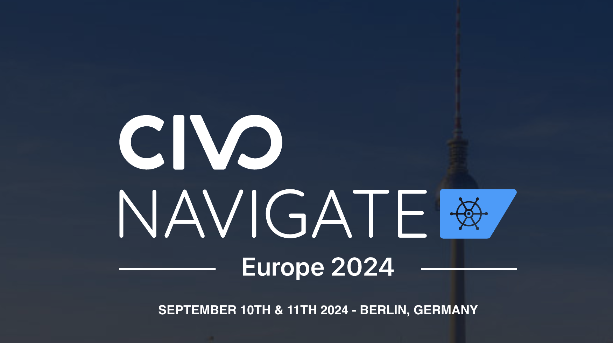

## Introduction

Today's post will not be as technical as previous ones however, I wanted to share my experience at the [Civo Navigate](https://www.civo.com/navigate/europe) in Berlin. I had the chance to talk at the conference, present [Sveltos](https://github.com/projectsveltos) and how it can be used to painlessly deploy different Kubernetes applications and monitoring capabilities on a fleet of clusters.

Apart from that, I attended many different sessions covering relevant topics (Cloud native, Security, Thought Leadership, AI) and meet fellow enthusiasts.

In the sections below, I will outline some of my highlights and afterwards provide an introduction to the Sveltos presentation alongside the useful resources.

<!--truncate-->

## Civo Navigate - Day 1

The day started quite chill by registering at the event, receiving a badge and becoming familiar with the location. Breakfast and coffee were provided which makes everything much easier.

Fully energized, the conference started with the keynotes and a positive outline of cloud computing, innovation and sustainability, which I can personally relate to it. More details about the Civo partnership with Deep Green can be found [here](https://www.civo.com/blog/greener-cloud-computing-deep-green). Afterwards, many empowering sessions took place, but some could not attend everything. I chose to attend those around developers empowerment and motivation. How developers can work best in diverse environments and how we can allow them to perform best by providing training, noise (notification) minimization, unnecessary meetings and freedom to think and decide on innovative solutions.

From a technical side, I enjoyed a session about testing in modern CI/CD pipelines which gave me a different view of Kubernetes testing. This particular session was an introduction to [testkube](https://github.com/kubeshop/testkube). Not sure how much you can get from the free version in comparison to an enterprise one. Furthermore, I appreciated the informative session about the [Event Driven Ansible](https://www.ansible.com/blog/event-driven-ansible-is-here/) to reduce automation reaction time.

After a long day and full of new ideas to try out in the lab, why not chill in the gaming area?

## Civo Navigate - Day 2

The day started with empowering keynotes from Kelsey Hightower about deep tech, Kubernetes, AI, and how the future might look like. The day continued with mostly technical sessions about open-source tools for Identity Management in Cloud Native stacks, platform engineering and [KUTTL](https://kuttl.dev/) for End-to-End (E2E) testing.

Some of the mentioned IAM tools are listed below.

- [Aaia](https://github.com/rams3sh/Aaia)
- [iamalive](https://github.com/iann0036/iamlive)
- [GCP Permissions](https://gcp.permissions.cloud/)

:::tip
Once the session recordings are available, a link will be included.
:::

## Civo Navigate - Sveltos

For the conference, we decided to demonstrate how Sveltos can be used to deploy and take over the control of the Container Network Interface (CNI) lifecycle with one manifest file while enabling Cilium Hubble for Network observability. In the second part of the presentation, we demonstrated how to create another set of manifest files to integrate Grafana, Prometheus and Loki for container logs output.

### Diagram

### Git Repository

The Git repository with the manifest files and the execution instructions are located [here](https://github.com/egrosdou01/civo_navigate_2024/tree/main).

## Conclusions

All in all, it was an awesome experience to have the chance to attend and speak at the conference. If you plan to attend any upcoming Civo Navigate conferences, check out the [link](https://www.civo.com/navigate). I am pretty confident you will have an enjoyable experience!

It's a wrap for this post! 🎉 Thanks for reading! Stay tuned for more exciting updates!