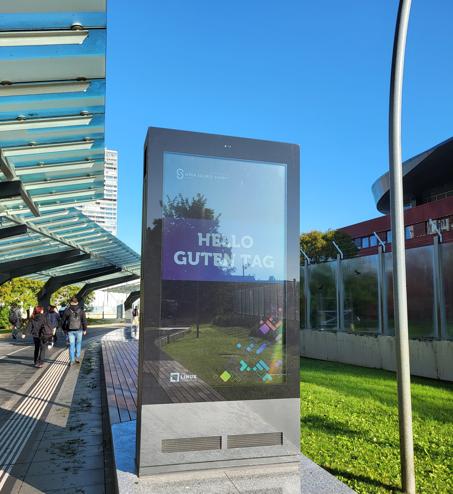
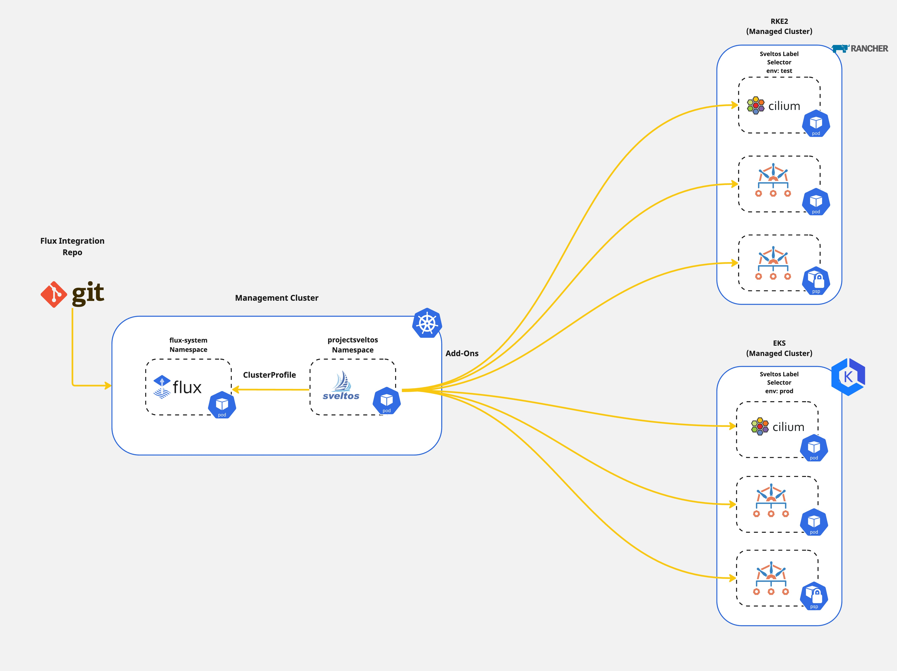
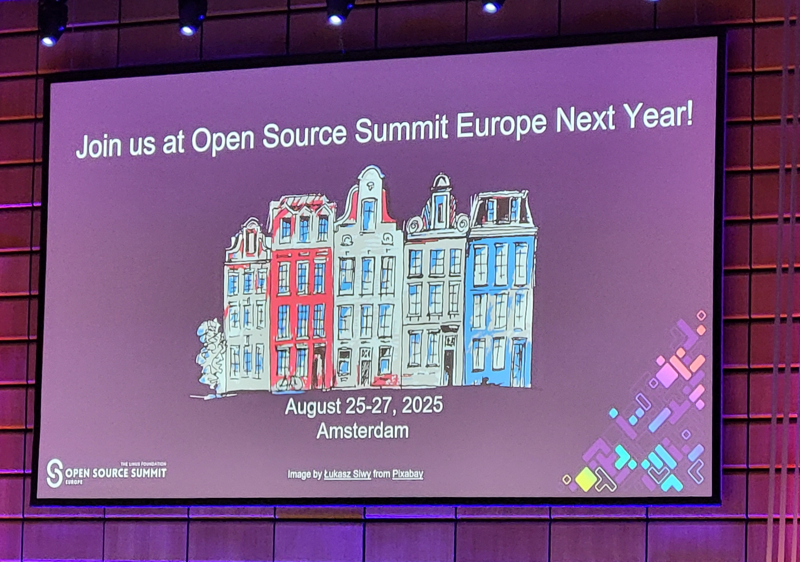

## Introduction

[Sveltos](https://github.com/projectsveltos) is on tour! Another non-technical post describing my experience at the [OSSummit Europe 2024](https://events.linuxfoundation.org/open-source-summit-europe/). Apart from outlining my experience, the post will include useful resources on open-source projects I learned during the event.

About Sveltos, [Gianluca Mardente](https://www.linkedin.com/in/gianlucamardente/) and I had the chance to talk at the conference and present Sveltos and how it is used to deploy and manage different Kubernetes applications and add-ons in a Multi-Cloud setup.

In the sections below, I will outline my highlights of the conference and what I have learned, while later on, I will describe what we presented about Sveltos and where to locate the required resources.

<!--truncate-->

## OSSummit - Day 1

As with any other conference, the day began with the registration, badge pick-up and familiarisation with the location. Of course, coffee was widely available in almost every corner of the conference!

For a quick look at the Day 1 keynotes, find below my highlights alongside the resources for further reading.

- [Linux Foundation, CNCF, Unified Patents - partnership expansion](https://www.linuxfoundation.org/press/linux-foundation-and-cncf-expand-partnership-with-unified-patents-to-defend-open-source-software-from-non-practicing-entities)
- [Linux Foundation, Valkey 8.0](https://www.prnewswire.com/news-releases/announcing-valkey-8-0--302248447.html)
- [Developer Relations Foundation Announcement](https://github.com/DevRel-Foundation)
- [Open Source Innovation in Artificial Intelligence and Data](https://lfaidata.foundation/)
- [The Linux Foundation Europe](https://linuxfoundation.eu/)

From a technical side, there was an announcement about the formation of the [OpenSearch Software Foundation](https://www.linuxfoundation.org/press/linux-foundation-announces-opensearch-software-foundation-to-foster-open-collaboration-in-search-and-analytics). AWS decided to move OpenSearch to the Linux Foundation. OpenSearch is a community-driven, Apache 2.0-licensed open-source search and analytics suite that makes it easy to ingest, search, visualise, and analyse data.

### OpenSearch - Resources

- [GitHub](https://github.com/opensearch-project)
- [OpenSearch Playground](https://playground.opensearch.org/app/home)

Apart from that, I was introduced to [cdk8s](https://cdk8s.io/) which is an open-source software development framework for defining Kubernetes applications. It synthesises applications into standard Kubernetes manifests files and supports a wide range of available programming languages like Typescript, Javascript, Go, Python, and Java.

### cdk8s - Resources

- [GitHub](https://github.com/cdk8s-team/cdk8s)
- [cdk8s Documentation](https://cdk8s.io/docs/latest/)

## OSSummit - Day 2

Why not start the day with a 5k run? Around 20ish people gathered together and enjoyed a morning run near the Danube river! The Day 2 keynotes involved topics around secure supply chain consumption with existing frameworks, how to be compliant in a cloud-native landscape and ways to perform Policy as Code.

### Frameworks

- [Secure Supply Chain Consumption Framework (S2C2F)](https://github.com/ossf/s2c2f)
- [SLSA](https://slsa.dev/)

### Container Image Patch Tools

- [COPA](https://github.com/project-copacetic/copacetic)

COPA is an open-source tool written in Go that allows DevSecOps engineers to directly patch container images given vulnerability scanning results from popular tools like [Trivy](https://trivy.dev/).

### Supply Chain Control Plane

- [Chainloop](https://github.com/chainloop-dev/chainloop)

Chainloop is an open-source project I found out while crowling at the booth. Chainloop provides a single source of truth for **metadata** and **artifacts**, plus a declarative attestation process. We can declaratively state the pieces of evidence and artifact expectations for different CI/CD pipelines.

### IoT

If you are interested in IoT, I had the chance to learn more about [Zephyr](https://github.com/zephyrproject-rtos/zephyr/tree/main) while attending interactive sessions about IoT development.

### Open-source and Research

If you have an interest in open-source research and enablement check out [TODO](https://todogroup.org/) and [LERO/CURIOOS](https://lero.ie/) initialives alongside the [opensource.net](https://opensource.net) website for relevant topics.

## OSSummit - Day 3

Day 3 started with a group talk on Kernel development and what development looks like with Rust. I found interesting the talk from Paolo De Rosa who talked about the European Digital Identity (EUDI) Wallet and the fact that they want to achieve this with the use of open-source while getting help from the community.

- [European Digital Identity (EUDI) Wallet](https://digital-strategy.ec.europa.eu/en/policies/eudi-wallet-implementation)

## OSSummit - Sveltos

For the conference, we decided to demonstrate how Sveltos can be used to deploy and manage the Container Network Interface (CNI) lifecycle on a fleet of clusters with one manifest file while enabling [Cilium Hubble](https://docs.cilium.io/en/stable/overview/intro/) for Network observability. In the second part of the presentation, we demonstrated how to create another set of manifest files to deploy [Kyverno](https://kyverno.io/) and specific cluster policies down the clusters based on their scope.

### Diagram

### Git Repository

The Git repository with the manifest files and the execution instructions is located [here](https://github.com/egrosdou01/OSSummit_2024).

## Conclusions

I had a great fun at the conference! Not only had the chance to present alongside Gianluca, but I also met and interacted with cloud-native enthusiasts.

Till next August 2025!

It's a wrap for this post! 🎉 Thanks for reading! Stay tuned for more exciting updates!