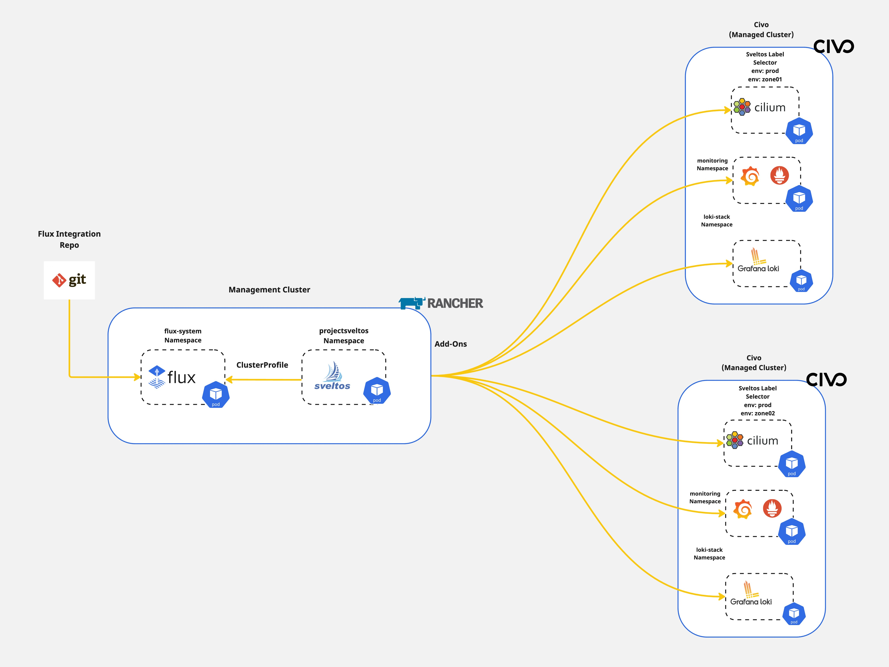

## Introduction

In previous posts, we outlined how [Sveltos](https://github.com/projectsveltos) allows Platform administrators and tenant administrators to streamline Kubernetes applications and add-on deployments in a fleet of clusters. In today's blog post, we will take a step further and demonstrate how easy it is to **target** and **update** a **subset** of resources targeted by **multiple configurations**. By multiple configurations we refer to the [Sveltos ClusterProfile or Profile](https://projectsveltos.github.io/sveltos/addons/addons/) Custom Resource Defintions (CRDs).

This functionality is called [tiers](https://projectsveltos.github.io/sveltos/deployment_order/tiers/). Sveltos tiers provides a solution for managing the **deployment priority** when resources are targeted by multiple configurations. Tiers are easily interagrated into existing ClusterProfile/Profile definitions alognside defining the deployment order control and override behaviour in a straightforward manner.

Today, we will cover the case of updating the [Cilium CNI](https://docs.cilium.io/en/latest/) in a subnet of clusters with the label set to `tier:zone2` without affecting the monitoring capabilities defined in the **same** ClusterProfile/Profile.



<!--truncate-->

## Lab Setup

```bash
+-----------------+-------------------+--------------------------+
|   Cluster Name  |        Type       |         Version          |
+-----------------+-------------------+--------------------------+
|   mgmt          | Mgmt Cluster      |      v1.28.9+rke2r1      |
|  prod-zone01    | Managed Cluster   |      v1.29.2+k3s1        |
|  prod-zone02    | Managed Cluster   |      v1.29.2+k3s1        |
+-----------------+-------------------+--------------------------+

+-------------+---------------------+
| Deployment  | Version             |
+-------------+---------------------+
| Cilium      | v1.15.6, v1.16.1    |
| sveltosctl  | v0.37.0             |
+-------------+---------------------+
```

## Prerequisites

To follow along, ensure the below are satisfied.

1. A management cluster with Sveltos installed
1. kubectl installed
1. sveltosctl installed

:::tip
If you are unaware of how to install Sveltos in a Kubernetes cluster, follow the instructions mentioned [here](https://projectsveltos.github.io/sveltos/getting_started/install/install/).
:::

## Step 1: Register Clusters with Sveltos

For this demonstration the [Civo Kubernetes](https://www.civo.com/kubernetes) cluster offering was used. Once the clusters are ready, it is time to proceed with the Sveltos cluster registration. To do that, we will utilise `sveltosctl`. The `sveltosctl` can be downloaded [here](https://github.com/projectsveltos/sveltosctl/releases).

```bash
$ sveltosctl register cluster --namespace=<namespace> --cluster=<cluster name> \
--kubeconfig=<path to Sveltos file with Kubeconfig> \
--labels=key1=value1,key2=value2
```

### Example Registration

```bash
$ sveltosctl register cluster --namespace=civo --cluster=mesh01 \
    --kubeconfig=/home/test/prod-zone01.yaml \
    --labels=env=prod,tier=zone01
```

We will register the clusters with Sveltos on the mentioned **namespace**, **name**, and will attach the cluster labels to perform different deployment versions.

:::note
If the namespace does not exist in the management cluster, the command will fail with the namespace not found error. Ensure the defined namespace exists in the cluster before registration.
:::

### Validation

```bash
$ export KUBECONFIG=<Sveltos managament cluster>

$ kubectl get sveltoscluster -A --show-labels
NAMESPACE   NAME          READY   VERSION          LABELS
mgmt        mgmt          true    v1.28.9+rke2r1   projectsveltos.io/k8s-version=v1.28.9,sveltos-agent=present
prod        prod-zone01   true    v1.28.7+k3s1     env=prod,projectsveltos.io/k8s-version=v1.28.7,sveltos-agent=present,tier=zone01
prod        prod-zone02   true    v1.28.7+k3s1     env=prod,projectsveltos.io/k8s-version=v1.28.7,sveltos-agent=present,tier=zone02
```

:::tip
Ensure the labels set to the managed clusters are correct. They will be used at a later step.
:::

## Step 2: Deploy Cilium and Monitoring Capabilities

As platform administrators, for every managed cluster we want to have Cilium as our CNI and monitoring capabilities with Grafana, Prometheus and Loki. To do that, we will use the Sveltos ClusterProfile Kubernetes resource and deployment the required deployments in clusters with the label set to `env:prod`.

### ClusterProfile - Cilium, Grafana, Prometheus

```yaml
---
apiVersion: config.projectsveltos.io/v1beta1
kind: ClusterProfile
metadata:
  name: cluster-prod-initial-setup
spec:
  clusterSelector:
    matchLabels:
      env: prod
  continueOnConflict: true
  helmCharts:
  - chartName: cilium/cilium
    chartVersion: 1.15.6
    helmChartAction: Install
    releaseName: cilium
    releaseNamespace: kube-system
    repositoryName: cilium
    repositoryURL: https://helm.cilium.io/
  - chartName: prometheus-community/kube-prometheus-stack
    chartVersion: v60.2.0
    helmChartAction: Install
    releaseName: prometheus-community
    releaseNamespace: monitoring
    repositoryName: prometheus-community
    repositoryURL: https://prometheus-community.github.io/helm-charts
    values: |
      grafana:
        service:
          type: LoadBalancer
      prometheus-node-exporter:
        service:
          port: 9200
          targetPort: 9200
  validateHealths:
  - name: deployment-health
    featureID: Helm
    group: "apps"
    version: "v1"
    kind: "Deployment"
    namespace: monitoring
    script: |
      function evaluate()
        local hs = {healthy = false, message = "Available replicas not match requested replicas"}
        if obj.status and obj.status.availableReplicas ~= nil and obj.status.availableReplicas == obj.spec.replicas then
          hs.healthy = true
        end
        return hs
      end
```

We instruct Sveltos to first install Cilium as our CNI. Next we deploy the Grafana and Prometheus stack and ensure the second deployment is in a `healthy` state before proceeding with the Loki integration. Once the validation health has succeeded, we will integrate Loki with the use of the below ClusterProfile.

### ClusterProfile - Loki

```yaml
---
apiVersion: config.projectsveltos.io/v1beta1
kind: ClusterProfile
metadata:
  name: loki-2102-prod
spec:
  dependsOn:
  - cluster-prod-initial-setup
  clusterSelector:
    matchLabels:
      env: prod
  continueOnConflict: true
  helmCharts:
  - repositoryURL: https://grafana.github.io/helm-charts
    repositoryName: grafana
    chartName: grafana/loki-stack
    chartVersion: v2.10.2
    releaseName: loki
    releaseNamespace: loki-stack
    helmChartAction: Install
```

:::note
Ensure the `dependsOn` contains the name of the initial ClusterProfile. In our example `cluster-prod-initial-setup`.
:::

### Deploy ClusterProfiles - Management Cluster

```bash
$ export KUBECONFIG=<Sveltos managament cluster> 

$ kubectl apply -f clusterprofile_prod_setup.yaml,clusterprofile_loki.yaml
```

### Validation - Management Cluster

```bash
$ ./sveltosctl show addons
+------------------+---------------+-------------+----------------------+---------+--------------------------------+-------------------------------------------+
|     CLUSTER      | RESOURCE TYPE |  NAMESPACE  |         NAME         | VERSION |              TIME              |                 PROFILES                  |
+------------------+---------------+-------------+----------------------+---------+--------------------------------+-------------------------------------------+
| prod/prod-zone01 | helm chart    | kube-system | cilium               | 1.15.6  | 2024-09-23 12:18:37 +0200 CEST | ClusterProfile/cluster-prod-initial-setup |
| prod/prod-zone01 | helm chart    | monitoring  | prometheus-community | 60.2.0  | 2024-09-23 12:18:47 +0200 CEST | ClusterProfile/cluster-prod-initial-setup |
| prod/prod-zone01 | helm chart    | loki-stack  | loki                 | 2.10.2  | 2024-09-23 12:20:38 +0200 CEST | ClusterProfile/loki-2102-prod             |
| prod/prod-zone02 | helm chart    | kube-system | cilium               | 1.15.6  | 2024-09-23 12:18:47 +0200 CEST | ClusterProfile/cluster-prod-initial-setup |
| prod/prod-zone02 | helm chart    | monitoring  | prometheus-community | 60.2.0  | 2024-09-23 12:18:56 +0200 CEST | ClusterProfile/cluster-prod-initial-setup |
| prod/prod-zone02 | helm chart    | loki-stack  | loki                 | 2.10.2  | 2024-09-23 12:20:47 +0200 CEST | ClusterProfile/loki-2102-prod             |
+------------------+---------------+-------------+----------------------+---------+--------------------------------+-------------------------------------------+
```

### Validation - Managed Cluster

```bash
$ kubectl get pods -n kube-system | grep -i cilium
cilium-operator-579c6c96c4-47wsk   1/1     Running   0          10m
cilium-operator-579c6c96c4-djk8s   1/1     Running   0          10m
cilium-mwk7x                       1/1     Running   0          10m
cilium-x5z5v                       1/1     Running   0          10m

$ kubectl get ds/cilium -n kube-system -o jsonpath='{.spec.template.spec.containers[0].image}'
quay.io/cilium/cilium:v1.15.6@sha256:6aa840986a3a9722cd967ef63248d675a87add7e1704740902d5d3162f0c0def

$ kubectl get pods -n monitoring 
NAME                                                       READY   STATUS    RESTARTS   AGE
prometheus-community-prometheus-node-exporter-78llc        1/1     Running   0          11m
prometheus-community-prometheus-node-exporter-xhcf9        1/1     Running   0          11m
prometheus-community-kube-operator-5746cfbb9-4p45x         1/1     Running   0          11m
prometheus-community-kube-state-metrics-7fc779fc58-z4ktb   1/1     Running   0          11m
alertmanager-prometheus-community-kube-alertmanager-0      2/2     Running   0          11m
prometheus-prometheus-community-kube-prometheus-0          2/2     Running   0          11m
prometheus-community-grafana-7494f9df89-pjqdd              3/3     Running   0          11m

$ kubectl get pods -n loki-stack
NAME                  READY   STATUS    RESTARTS   AGE
loki-promtail-ttdgx   1/1     Running   0          10m
loki-promtail-jq5td   1/1     Running   0          10m
loki-0                1/1     Running   0          10m
```

We managed to install Cilium, Grafana, Prometheus and Loki to our Productions clusters. This is awseome! 🎉 Now, let's continue with the update of Cilium on a subnet of clusters only.

## Step 3: Update Cilium tier:zone02 Cluster

As mentioned before, we would like to use the Sveltos `tier` feature to update `Cilium` only on the clusters with the label set to `tier:zone02`. The matching cluster in our example will be the `prod-zone01` cluster.

**Issue**: As we have a ClusterProfile that installed Cilium to the cluster `prod-zone01`, how can we instruct Sveltos to update this cluster and only the Cilium deployment?

To achieve this, we will create a new ClusterProfile with the user of `tier`. Basically, we will instruct Sveltos to take the new ClusterProfile with a lower `tier` value set and update Cilium CNI only on the matching clusters.

:::note
The default `tier` value for every ClusterProfile/Profile is set to 100. If you set this to a lower value, Sveltos will take the lower value as a higher priority deployment.
:::

### ClusterProfile - Update Cilium

```yaml
---
apiVersion: config.projectsveltos.io/v1beta1
kind: ClusterProfile
metadata:
  name: cilium-1161
spec:
  tier: 50
  clusterSelector:
    matchLabels:
      tier: zone02
  continueOnConflict: true
  helmCharts:
  - chartName: cilium/cilium
    chartVersion: 1.16.1
    helmChartAction: Install
    releaseName: cilium
    releaseNamespace: kube-system
    repositoryName: cilium
    repositoryURL: https://helm.cilium.io/
```

### Validation - Management Cluster


```bash
$ ./sveltosctl show addons --cluster=prod-zone02
+------------------+---------------+-------------+----------------------+---------+--------------------------------+-------------------------------------------+
|     CLUSTER      | RESOURCE TYPE |  NAMESPACE  |         NAME         | VERSION |              TIME              |                 PROFILES                  |
+------------------+---------------+-------------+----------------------+---------+--------------------------------+-------------------------------------------+
| prod/prod-zone02 | helm chart    | monitoring  | prometheus-community | 60.2.0  | 2024-09-23 12:18:56 +0200 CEST | ClusterProfile/cluster-prod-initial-setup |
| prod/prod-zone02 | helm chart    | loki-stack  | loki                 | 2.10.2  | 2024-09-23 12:20:47 +0200 CEST | ClusterProfile/loki-2102-prod             |
| prod/prod-zone02 | helm chart    | kube-system | cilium               | 1.16.1  | 2024-09-23 12:32:27 +0200 CEST | ClusterProfile/cilium-1161                |
+------------------+---------------+-------------+----------------------+---------+--------------------------------+-------------------------------------------+
```

### Validation - Managed Cluster

```bash
$ kubectl get pods -n kube-system | grep -i cilium                                                  
cilium-operator-66dcfc4678-76j6m   1/1     Running   0          2m44s
cilium-operator-66dcfc4678-6wvbr   1/1     Running   0          2m44s
cilium-xnt7k                       1/1     Running   0          2m44s
cilium-envoy-rj8pj                 1/1     Running   0          2m45s
cilium-8fbzc                       1/1     Running   0          2m44s
cilium-envoy-hkhmc                 1/1     Running   0          2m45s

$ kubectl get ds/cilium -n kube-system -o jsonpath='{.spec.template.spec.containers[0].image}'
quay.io/cilium/cilium:v1.16.1@sha256:0b4a3ab41a4760d86b7fc945b8783747ba27f29dac30dd434d94f2c9e3679f39
```

## Sveltos Tiers Benefits

Sveltos tiers allow seamless **targeting** and **update** of different Kubernetes applications and add-ons in a subset of clusters. Now, we have a way to perform updates without headaches, be confident and full of control using the GitOps approach.

## Conclusions

In a couple of minutes, with a minimal configuration effort and following the GitOps approach we updated Cilium CNI in a subset of clusters painless! Find more about the Sveltos tiers [here](https://projectsveltos.github.io/sveltos/deployment_order/tiers/).

## ✉️ Contact

We are here to help! Whether you have questions, or issues or need assistance, our Slack channel is the perfect place for you. Click here to [join us](https://app.slack.com/client/T0471SNT5CZ/C06UZCXQLGP) us.

## 👏 Support this project

Every contribution counts! If you enjoyed this article, check out the Projectsveltos [GitHub repo](https://github.com/projectsveltos). You can [star 🌟 the project](https://github.com/projectsveltos) if you find it helpful.

The GitHub repo is a great resource for getting started with the project. It contains the code, documentation, and many more examples.

Thanks for reading!