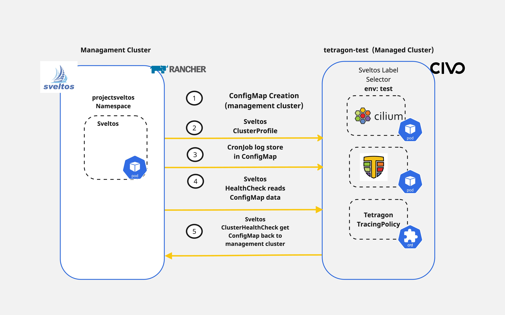

## Introduction

How easy is it to handle **Day-2** operations with existing CI/CD tooling? [Sveltos](https://github.com/projectsveltos) provides the ability to perform not only **Day-0** operations but also helps platform administrators, tenant administrators and other operators with **Day-2** operations. For example, we can use the [HealthCheck](https://github.com/projectsveltos/libsveltos/blob/main/api/v1beta1/healthcheck_type.go) and the [ClusterHealthCheck](https://raw.githubusercontent.com/projectsveltos/libsveltos/main/api/v1beta1/clusterhealthcheck_type.go) features to not only watch the health of a cluster but also collect information from the `managed` clusters and display them in the `management` cluster.

In today's blog post, we will cover a way of deploying [Cilium](https://cilium.io/) as our CNI alongside [Cilium Tetragon](https://tetragon.io/) for observability. We will then continue with a simple `TracingPolicy` deployment to capture socket connections and then use Sveltos to display the tracing results back to the `management` cluster.

The goal of the demonstration is to showcase how Sveltos can be used for different Kubernetes cluster operations based on the use case at hand.



<!--truncate-->

## Lab Setup

```bash
+-----------------+-------------------+--------------------------+
|   Cluster Name  |        Type       |         Version          |
+-----------------+-------------------+--------------------------+
|      mgmt       |   Mgmt Cluster    |      v1.28.9+rke2r1      |
| tetragon-test   |  Managed Cluster  |      v1.29.2+k3s1        |
+-----------------+-------------------+--------------------------+

+-------------+---------------------+
|  Deployment  |        Version     |
+-------------+---------------------+
|    Cilium    |       v1.16.1      |
|   Tetragon   |       v1.2.0       |
|  sveltosctl  |       v0.37.0      |
+-------------+---------------------+

```

## Prerequisites

To follow along, ensure the below are satisfied.

1. A management cluster with Sveltos installed
1. kubectl installed
1. sveltosctl installed

:::tip
If you are unaware of installing Sveltos in a Kubernetes cluster, follow the instructions mentioned [here](https://projectsveltos.github.io/sveltos/getting_started/install/install/).
:::

## Step 1: Cluster Registration with Sveltos

Once the Kubernetes cluster is ready, we can continue with the Sveltos registration. To do that, we will utilise `sveltosctl`. The `sveltosctl` can be downloaded [here](https://github.com/projectsveltos/sveltosctl/releases).

### Example Registration

```bash
$ sveltosctl register cluster --namespace=test --cluster=tetragon-test \
    --kubeconfig=/home/test/tetragon-test.yaml \
    --labels=env=test
```

The cluster above will be registered with Sveltos on the mentioned **namespace**, and **name**, and will attach the cluster labels to perform different deployment versions.

:::note
If the namespace does not exist in the management cluster, the command will fail with the namespace not found error. Ensure the defined namespace exists in the cluster before registration.
:::

### Validation

```bash
$ export KUBECONFIG=<Sveltos managament cluster>

$ kubectl get sveltoscluster -A --show-labels
NAMESPACE   NAME          READY   VERSION          LABELS
mgmt        mgmt            true    v1.28.9+rke2r1   projectsveltos.io/k8s-version=v1.28.9,sveltos-agent=present
test        tetragon-test   true    v1.29.2+k3s1     env=test,projectsveltos.io/k8s-version=v1.29.2,sveltos-agent=present
```

:::tip
Ensure the labels set are correct. We will use them at a later step.
:::

## Step 2: Custom ConfigMap, Cilium, Tetragon Deployment

As a first step, we will deploy **Cilium** and **Cilium Tetragon** to the clusters with the label set to `env:test`. Then, we will deploy a `ConfigMap` on the `management` cluster and allow Sveltos to deploy a `TracingPolicy` alongside a `CronJob` that polls tracing events every 2 minutes from the targeted `managed` cluster.

### ClusterProfile - Cilium, Tetragon, and ConfigMap

```yaml
---
apiVersion: config.projectsveltos.io/v1beta1
kind: ClusterProfile
metadata:
  name: tetragon-test-deploy
spec:
  clusterSelector:
    matchLabels:
      env: test
  helmCharts:
  - chartName: cilium/cilium
    chartVersion: 1.16.1
    helmChartAction: Install
    releaseName: cilium
    releaseNamespace: kube-system
    repositoryName: cilium
    repositoryURL: https://helm.cilium.io/
  - chartName: cilium/tetragon
    chartVersion: 1.2.0
    helmChartAction: Install
    releaseName: tetragon
    releaseNamespace: kube-system
    repositoryName: tetragon
    repositoryURL: https://helm.cilium.io/
  policyRefs:
  - name: tetragon-policy-socket-log
    namespace: default
    kind: ConfigMap
```

Sveltos follows the top-down approach when it comes to add-on and application deployment. First, Cilium will get deployed as our CNI. Next, then **Tetragon** and afterwards, we proceed with the deployment of a `ConfigMap` with the name `tetragon-policy-socket-log` which has already been deployed in the `management` cluster.

:::tip
A copy of the `ConfigMap` YAML definition is located [here](https://github.com/egrosdou01/sveltos-demo-resources/blob/main/day-2-operations/sveltos-cilium-tetragon/env-test/tetragon_configmap.yaml).
:::

### Deploy ConfigMap and ClusterProfile - Management Cluster

```bash
$ export KUBECONFIG=<Sveltos managament cluster> 

$ kubectl apply -f tetragon_cm.yaml,clusterprofile_tetragon.yaml
```

### Validation - Management Cluster

```bash
$ ./sveltosctl show addons                                         
+--------------------+----------------------------------------------+-------------+-------------------------------+---------+--------------------------------+-------------------------------------+
|      CLUSTER       |                RESOURCE TYPE                 |  NAMESPACE  |             NAME              | VERSION |              TIME              |              PROFILES               |
+--------------------+----------------------------------------------+-------------+-------------------------------+---------+--------------------------------+-------------------------------------+
| test/tetragon-test | helm chart                                   | kube-system | cilium                        | 1.16.1  | 2024-10-06 09:28:12 +0200 CEST | ClusterProfile/tetragon-test-deploy |
| test/tetragon-test | helm chart                                   | kube-system | tetragon                      | 1.2.0   | 2024-10-06 09:28:15 +0200 CEST | ClusterProfile/tetragon-test-deploy |
| test/tetragon-test | rbac.authorization.k8s.io:ClusterRoleBinding |             | tetragon-cluster-role-binding | N/A     | 2024-10-06 09:28:12 +0200 CEST | ClusterProfile/tetragon-test-deploy |
| test/tetragon-test | batch:CronJob                                | default     | tetragon-log-fetcher          | N/A     | 2024-10-06 09:28:12 +0200 CEST | ClusterProfile/tetragon-test-deploy |
| test/tetragon-test | cilium.io:TracingPolicy                      |             | networking                    | N/A     | 2024-10-06 09:28:12 +0200 CEST | ClusterProfile/tetragon-test-deploy |
| test/tetragon-test | :ServiceAccount                              | default     | tetragon-sa                   | N/A     | 2024-10-06 09:28:12 +0200 CEST | ClusterProfile/tetragon-test-deploy |
| test/tetragon-test | rbac.authorization.k8s.io:ClusterRole        |             | tetragon-cluster-role         | N/A     | 2024-10-06 09:28:12 +0200 CEST | ClusterProfile/tetragon-test-deploy |
+--------------------+----------------------------------------------+-------------+-------------------------------+---------+--------------------------------+-------------------------------------+
```

### Validation - Managed Cluster

```bash
$ kubectl get pods -n kube-system | grep -E "cilium|tetragon"
cilium-operator-8547744bd7-qhl7r     1/1     Running   0          4m30s
cilium-operator-8547744bd7-m26lh     1/1     Running   0          4m30s
tetragon-mln8g                       2/2     Running   0          4m29s
tetragon-c7gwj                       2/2     Running   0          4m29s
tetragon-tjx54                       2/2     Running   0          4m29s
cilium-g7ftd                         1/1     Running   0          4m30s
cilium-pv9gj                         1/1     Running   0          4m30s
cilium-9cr4l                         1/1     Running   0          4m30s
cilium-envoy-9kjnv                   1/1     Running   0          4m30s
cilium-envoy-fpqkl                   1/1     Running   0          4m30s
cilium-envoy-25gvv                   1/1     Running   0          4m30s
tetragon-operator-55c555fcf4-s5mvs   1/1     Running   0          4m29s

$ kubectl get cronjobs,jobs,pods
NAME                                 SCHEDULE      SUSPEND   ACTIVE   LAST SCHEDULE   AGE
cronjob.batch/tetragon-log-fetcher   */2 * * * *   False     0        98s             5m26s

NAME                                      COMPLETIONS   DURATION   AGE
job.batch/install-traefik2-nodeport-te    1/1           11s        47h
job.batch/tetragon-log-fetcher-28803330   1/1           10s        3m38s
job.batch/tetragon-log-fetcher-28803332   1/1           9s         98s

NAME                                      READY   STATUS      RESTARTS   AGE
pod/install-traefik2-nodeport-te-zrh57    0/1     Completed   0          47h
pod/tetragon-log-fetcher-28803330-wpl9r   0/1     Completed   0          3m38s
pod/tetragon-log-fetcher-28803332-r7q5v   0/1     Completed   0          98s
```

Based on the output above, we have deployed **Cilium**, **Tetragon** and a **CronJob** to collect Tetragon logs based on a tracing policy every 2 minutes with a timeout of 5 sec. 🎉 We can proceed further and use the Sveltos `ClucterHealthCheck` and `HealthCheck` to collect the data of the newly created `ConfiMap` in the managed cluster.

:::note
If the defined `ConfigMap` or `CronJob` does not fit your needs, feel free to update the YAML definitions based on your liking.
:::

## Step 3: Deploy ClusterHealthCheck and HealthCheck

To be able to collect resources from the Sveltos managed cluster, we will use a new YAML definition to collect the data from the `ConfigMap` with the name `tetragon-logs`.

:::tip
The `ConfigMap tetragon-logs` is **created** and **patched** with a periodic execution of `Jobs` mentioned in Step 2.
:::

### HealthCheck and ClusterHealthCheck Defintion

```yaml
# Collect the resource of the ConfigMap with the name `tetragon-logs`
---
apiVersion: lib.projectsveltos.io/v1beta1
kind: HealthCheck
metadata:
  name: tetragon-log-fetcher
spec:
  collectResources: true
  resourceSelectors:
  - group: ""
    version: "v1"
    kind: "ConfigMap"
    name: tetragon-logs
    namespace: default
  evaluateHealth: |
    function evaluate()
      local statuses = {}

      for _,resource in ipairs(resources) do
        status = "Degraded"
        table.insert(statuses, {resource=resource, status = status, message = resource.data["tetragon-logs.txt"]})
      end

      local hs = {}
      if #statuses > 0 then
        hs.resources = statuses 
      end
      return hs
    end
# Get the ConfigMap data and send it to the management cluster
---
apiVersion: lib.projectsveltos.io/v1beta1
kind: ClusterHealthCheck
metadata:
  name: tetragon-log-fetcher
spec:
  clusterSelector:
    matchLabels:
      env: test
  livenessChecks:
  - name: tetragon-log-fetcher
    type: HealthCheck
    livenessSourceRef:
      kind: HealthCheck
      apiVersion: lib.projectsveltos.io/v1beta1
      name: tetragon-log-fetcher
  notifications:
  - name: event
    type: KubernetesEvent
```

### Deploy HealthCheck and ClusterHealthCheck - Management Cluster

```bash
$ export KUBECONFIG=<Sveltos managament cluster> 

$ kubectl apply -f tetragon_healthcheck_logs.yaml
```


### Validation - Management Cluster

```bash
$ ./sveltosctl show resources
+--------------------+---------------------+-----------+---------------+--------------------------------------------------------------------------------------------------------------+
|      CLUSTER       |         GVK         | NAMESPACE |     NAME      |                                                   MESSAGE                                                    |
+--------------------+---------------------+-----------+---------------+--------------------------------------------------------------------------------------------------------------+
| test/tetragon-test | /v1, Kind=ConfigMap | default   | tetragon-logs | 🔌 connect kube-system/coredns-6799fbcd5-4bv5r /coredns tcp 127.0.0.1:35846 ->                               |
|                    |                     |           |               | 127.0.0.1:8080 🧹 close   kube-system/coredns-6799fbcd5-4bv5r /coredns tcp 127.0.0.1:35846                   |
|                    |                     |           |               | -> 127.0.0.1:8080 🧹 close   kube-system/coredns-6799fbcd5-4bv5r /coredns tcp 127.0.0.1:8080                 |
|                    |                     |           |               | -> 127.0.0.1:35846 🔌 connect kube-system/coredns-6799fbcd5-4bv5r /coredns tcp                               |
|                    |                     |           |               | 127.0.0.1:35852 -> 127.0.0.1:8080 🧹 close   kube-system/coredns-6799fbcd5-4bv5r /coredns tcp                |
|                    |                     |           |               | 127.0.0.1:35852 -> 127.0.0.1:8080 🧹 close   kube-system/coredns-6799fbcd5-4bv5r /coredns tcp                |
|                    |                     |           |               | 127.0.0.1:8080 -> 127.0.0.1:35852 🔌 connect k3s-tetragon-9ab2-92fa7d-node-pool-df07-7inhp                   |
|                    |                     |           |               | /var/lib/rancher/k3s/data/7d0aa19ffc230d4322f04d1ae8783e54ce189dfc4cbfa0a6afcdcabec2346d0c/bin/k3s           |
+--------------------+---------------------+-----------+---------------+--------------------------------------------------------------------------------------------------------------+
```

From the output above, we see the logs collected from the Tetragon TracingPolicy coming from a `managed` cluster and making them available in a `management` cluster! Cool, right? The same approach can be used with different data located in the `managed` clusters. A post written by Gianluca outlining the collection of `kube-bench` scanning results can be found [here](https://itnext.io/ensurincis-benchmark-compliance-across-multiple-kubernetes-clusters-dd544682e786).

## Sveltos for Day-2 Operations Benefits

Sveltos allows users to deploy the required add-on and deployments to a fleet of clusters while allowing platform administrators and operators to **enhance** the **security posture** and **observability** of the clusters in a simple and meaningful way. Use the Sveltos `Event Framework`, `Tiers`, `ClusterHealthCheck`, and `HealthCheck` features to enhance the posture of different platforms!

## Conclusions

In a few minutes ⏳, with minimal configuration effort and following the GitOps approach, we deployed Cilium as our CNI, Cilium Tetragon for observability alongside polling and displaying of critical tracing results to the management cluster painlessly! 🎉

In the next blog posts, we will touch on topics around Day-2 operations.

## Resources

- **Cilium Labs**: https://isovalent.com/resource-library/labs/
- **Tetragon - Getting Started Lab**: https://isovalent.com/labs/tetragon-getting-started/
- **Sveltos ClusterHealthCheck/HealthCheck**: https://projectsveltos.github.io/sveltos/observability/notifications/#example-configmap-healthcheck
- **Sveltos Event Framework**: https://projectsveltos.github.io/sveltos/events/addon_event_deployment/
- **Sveltos Tiers**: https://projectsveltos.github.io/sveltos/deployment_order/tiers/

## ✉️ Contact

We are here to help! Whether you have questions, or issues or need assistance, our Slack channel is the perfect place for you. Click here to [join us](https://app.slack.com/client/T0471SNT5CZ/C06UZCXQLGP) us.

## 👏 Support this project

Every contribution counts! If you enjoyed this article, check out the Projectsveltos [GitHub repo](https://github.com/projectsveltos). You can [star 🌟 the project](https://github.com/projectsveltos) if you find it helpful.

The GitHub repo is a great resource for getting started with the project. It contains the code, documentation, and many more examples.

Thanks for reading!