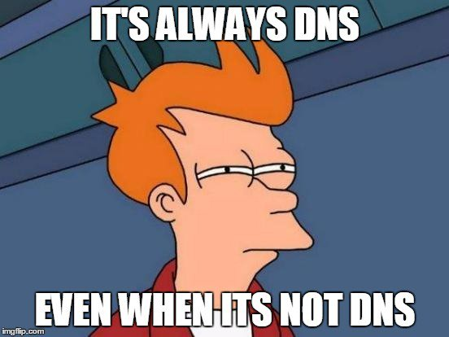

## Introduction

This is the first post introducing the **new** Kubernetes Troubleshooting Insights section! The series of blog posts will share helpful information and troubleshooting tips for issues that might appear in a Kubernetes environment. The posts are focused on real-life scenarios from either `test`, `staging` or `production` environments.

In today’s blog post, we’ll explore an issue with [CoreDNS](https://kubernetes.io/docs/tasks/administer-cluster/coredns/) setup on [RKE2](https://docs.rke2.io/) clusters. [Cilium](https://docs.cilium.io/en/stable/overview/intro/#what-is-cilium) CNI with [Hubble](https://docs.cilium.io/en/stable/overview/intro/#what-is-hubble) is enabled. Let’s jump right in!



<!--truncate-->

## Environment Setup

```bash
+-----------------+-------------------+--------------------------+----------------+
|   Cluster Name  |        Type       |         Version          |       OS       |
+-----------------+-------------------+--------------------------+----------------+
|    cluster01    |  Managed Cluster  |      v1.28.14+rke2r1     |   Ubuntu 22.04 |
+-----------------+-------------------+--------------------------+----------------+


+-------------+---------------------+
|  Deployment  |        Version     |
+-------------+---------------------+
|    Cilium    |       v1.16.1      |
+-------------+---------------------+

```

## Scenario

We performed a major migration of an environment to a new instance including **new DNS** servers and **domains**. We had to test if everything was working with the new setup. Everything appeared to work fine apart from synchronising ArgoCD with internal Git repositories. An error from an **internal Kubernetes IP address** on port **53** appeared. Weird, right? We were confident the underlying virtual machines were using the correct DNS, and the configuration of the DHCP server was updated.

:::note
The troubleshooting session took place on an Ubuntu 22.04 environment. If you use another operating system, the troubleshooting methodology remains the same. The Linux commands will not be relevant.
:::

## Troubleshooting Steps

### Step 1: Underlying Infrastructure Troubleshooting

The below steps were performed to double-check the underlying infrastructure.

1. **DHCP Server (if used)**: Ensure the configuration points to the new DNS servers

    ```bash
    $ cat /etc/dhcp/dhcpd.conf
    ```
    Check the `domain-name-servers` configuration.

1. **Cluster Node**: Ensure the new DNS servers are used. Ensure we can resolve the domain of interest.

    ```bash
    $ cat /etc/resolv.config # Check the local DNS configuration

    $ sudo resolve.ctl status # Check the global and per-link DNS settings currently in effect
    ```
    From the command above, we would like to see how the Ethernet network interface on the virtual machine resolves domains. The ```resolvectl status``` command should reveal the use of the new DNS servers.
1. **Cluster Node**: Perform a CURL

    Ensure we can resolve the domain from the **cluster node** before continuing.

      ```bash
      $ curl <domain name>:<port>
      ```

### Step 2: Kubernetes Troubleshooting

Depending on the Kubernetes environment in place, identify how DNS queries are resolved from a Kubernetes cluster point of view. In our case, the RKE2 clusters use `CoreDNS`.

1. Deploy the `dns-utils` [pod](https://kubernetes.io/docs/tasks/administer-cluster/dns-debugging-resolution/) to check DNS queries
    ```bash
    $ kubectl apply -f - <<EOF
      apiVersion: v1
      kind: Pod
      metadata:
        name: dnsutils
        namespace: default
      spec:
        containers:
        - name: dnsutils
          image: registry.k8s.io/e2e-test-images/agnhost:2.39
          imagePullPolicy: IfNotPresent
        restartPolicy: Always
      EOF
    ```
1. Exec into the `dnsutils` pod and perform CURL and dig commands
    ```bash
    $ kubectl exec -it dnsutils -- /bin/sh
    / # curl -vvv example-domain.com
      * Could not resolve host: example-domain.com
      * Closing connection 0
      curl: (6) Could not resolve host: example-domain.com
    / # dig example-domain.com
    ...
    ;; AUTHORITY SECTION:
    example-domain.com.	20	IN	SOA	ns.dns.example-domain.com. hostmaster.example-domain.com. 1729344685 7200 1800 86400 30
    ```
    :::note
    From the commands above, we can see that we cannot resolve the `example-domain.com`. It is important to check the `AUTHORITY SECTION` of the `dig` command output.
    `SOA ns.dns.example-domain.com.` signifies that the record is an SOA record, which provides essential information about a DNS zone. The `ns.dns.example-domain.com.` defines the primary DNS for the domain. But why? We would expect to see one of the new DNS servers instead.
    :::

1. Identify the CoreDNS deployment
    ```bash
    $ kubectl get deploy -n kube-system
    rke2-coredns-rke2-coredns              2/2     2            2           23h
    rke2-coredns-rke2-coredns-autoscaler   1/1     1            1           23h
    ```
1. Check the `CoreDNS ConfigMap`
    ```bash
    $ kubectl get cm -n kube-system
    chart-content-rke2-coredns                             1      23h
    rke2-coredns-rke2-coredns                              1      23h
    rke2-coredns-rke2-coredns-autoscaler                   1      23h

    $ kubectl get cm rke2-coredns-rke2-coredns -n kube-system -o jsonpath='{.data.Corefile}'
      .:53 {
      errors 
      health  {
          lameduck 5s
      }
      ready 
      kubernetes example-domain.com   cluster.local  cluster.local in-addr.arpa ip6.arpa {
          pods insecure
          fallthrough in-addr.arpa ip6.arpa
          ttl 30
      }
      prometheus   0.0.0.0:9153
      forward   . /etc/resolv.conf
      cache   30
      loop 
      reload 
      loadbalance 
      }
    ```
    :::tip
    We have an interest in what is included in the `/etc/resolv.conf` file inside the `CoreDNS` pod. Also, the following `kubernetes example-domain.com   cluster.local  cluster.local in-addr.arpa ip6.arpa` is something we will explain later on.
    :::
1. Exec to the CoreDNS deployment and `cat` the `/etc/resolv.conf`
    ```bash
    $ kubectl exec -it deploy/rke2-coredns-rke2-coredns -n kube-system -- cat /etc/resolv.conf
      nameserver <DNS01 IP>
      nameserver <DNS02 IP>
    ```
    If the above output returns the expected nameservers, continue with the next step.
1. Understad the configuration output of the CoreDNS

    The output `kubernetes example-domain.com   cluster.local  cluster.local in-addr.arpa ip6.arpa` indicates that CoreDNS is responsible for responsing to DNS queries of the defined domain. Should `CoreDNS` be responsible for responsing to queries about the `example-domain.com` record or this is just a misconfiguration?

In our case, the custom domain was included in the CoreDNS configuration by mistake. Responses to DNS queries related to the custom domain should be forwarded to the internal DNS server instead.

If this is the case for your environment, edit the `ConfigMap` and remove the custom domain from the configuration. Use the commands below.

```bash
$ kubectl patch cm rke2-coredns-rke2-coredns -n kube-system --type='json' -p='[{"op": "replace", "path": "/data/Corefile", "value": ".:53 {\n    errors \n    health  {\n        lameduck 5s\n    }\n    ready \n    kubernetes cluster.local cluster.local in-addr.arpa ip6.arpa {\n        pods insecure\n        fallthrough in-addr.arpa ip6.arpa\n        ttl 30\n    }\n    prometheus 0.0.0.0:9153\n    forward . /etc/resolv.conf\n    cache 30\n    loop \n    reload \n    loadbalance \n}"}]'

configmap/rke2-coredns-rke2-coredns patched

$ kubectl get cm rke2-coredns-rke2-coredns -n kube-system -o jsonpath='{.data.Corefile}' # Ensure the custom domain is removed

$ kubectl exec -it dnsutils -- /bin/sh
/ # curl <domain>:<port> # You should be able to resolved the domain now
```

### Optional: Troubleshoot with Cilium Hubble

Another option to troubleshoot network issues is with Hubble. If it is available as part of your installation, you can exec into the Cilium `daemonset` and start using the Hubble CLI to observe traffic. For example, you can use something like the below.

```bash
$ kubectl exec -it ds/cilium -n kube-system -- /bin/sh
# hubble observe --pod rke2-coredns-rke2-coredns-84b9cb946c-b7l9k --namespace kube-system --protocol UDP -f
```
The command above will display UDP packages between the `dnsutils` pod and `CoreDNS`. The Hubble cheat sheet can be found [here](https://cilium.isovalent.com/hubfs/marketing%20briefs/Isovalent%20-%20Cilium%20Hubble%20Cheat%20Sheet.pdf).

### Optional: Troubleshoot with Netshoot Pod and TCPDump

If we want to see what is happening with the UDP packages when we perform a CURL request on a custom domain, it might be easier to instantiate a `tcpdump` using the [netshoot](https://hub.docker.com/r/nicolaka/netshoot/tags) pod. Follow the commands below.

```bash
$ kubectl run -it --rm debug --image=nicolaka/netshoot -- /bin/bash
debug:~# tcpdump -i eth0 -n udp port 53
```

Once the tcpdump is enabled, exec into the same pod and start performing CURL requests.

```bash
$ kubectl exec -it dnsutils -n kube-system -- /bin/sh
/ # curl example-domain.com
```

### tcpdump Output

```bash
tcpdump: verbose output suppressed, use -v[v]... for full protocol decode
listening on eth0, link-type EN10MB (Ethernet), snapshot length 262144 bytes
16:31:52.197604 IP 10.42.2.184.49109 > 10.43.0.10.53: 59274+ [1au] A? example-domain.com.default.svc.cluster.local. (86)
16:31:52.197677 IP 10.42.2.184.49109 > 10.43.0.10.53: 134+ [1au] AAAA? example-domain.com.default.svc.cluster.local. (86)
16:31:52.198333 IP 10.43.0.10.53 > 10.42.2.184.49109: 59274 NXDomain*- 0/1/1 (179)
16:31:52.198553 IP 10.43.0.10.53 > 10.42.2.184.49109: 134 NXDomain*- 0/1/1 (179)
```

The output above indicates that a client queries a DNS server of a specific domain, and the server responds that the domain does not exist. This would be a hint to check the `CoreDNS` configuration! :)

## Resources

- **Debugging DNS**: https://kubernetes.io/docs/tasks/administer-cluster/dns-debugging-resolution/

## Conclusions

Is it DNS at the end? This is something you will have to find out! Hopefully, the post gave you some ideas to troubleshoot with more confidence DNS issues in a Kubernetes environment.

It's a wrap for this post! 🎉 Thanks for reading! Stay tuned for more exciting updates!
