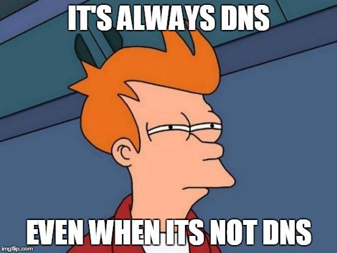

## Introduction

Welcome to the the first post of the brand new Kubernetes Troubleshooting Insights section! The series of blog posts will share helpful information and troubleshooting tips for issues that might appear in a Kubernetes environment. The posts are focused on real-life scenarios from either `test`, `staging` or `production` environments.

In today’s blog post, we’ll explore an issue with [CoreDNS](https://kubernetes.io/docs/tasks/administer-cluster/coredns/) setup on [RKE2](https://docs.rke2.io/) clusters. [Cilium](https://docs.cilium.io/en/stable/overview/intro/#what-is-cilium) CNI with [Hubble](https://docs.cilium.io/en/stable/overview/intro/#what-is-hubble) were enabled for this setup. Let’s jump right in!



<!--truncate-->

## Environment Setup

```bash
+-----------------+-------------------+--------------------------+----------------+
|   Cluster Name  |        Type       |         Version          |       OS       |
+-----------------+-------------------+--------------------------+----------------+
|    cluster01    |  Managed Cluster  |      v1.28.14+rke2r1     |   Ubuntu 22.04 |
+-----------------+-------------------+--------------------------+----------------+


+-------------+---------------------+
|  Deployment  |        Version     |
+-------------+---------------------+
|    Cilium    |       v1.16.1      |
+-------------+---------------------+

```

## Scenario

DNS issues are wide and can be are caused by many reasons. Unfortunately, there is no one-size-fits-all approach when it comes to troubleshooting. In our scenario, we started with the virtual machines, ensured routing and DNS work and then moved to the Kubernetes layer. The blog post is an attempt to provide readers with troubleshooting ideas about DNS issues.

**Background**: We performed a major migration to a new instance with **new DNS** servers and **domains**. We had to test if everything worked with the new setup. Everything appeared fine apart from synchronising **ArgoCD** with internal Git repositories. An error from an **internal Kubernetes IP address** on port **53** appeared. Weird, right? We were confident the underlying virtual machines were using the correct DNS, and the configuration of the DHCP server was updated.

:::note
The troubleshooting session was performed on an Ubuntu 22.04 environment. If another operating system is used, the troubleshooting methodology remains the same. The Linux commands will be different.
:::

## Troubleshooting Steps

### Step 1: Underlying Infrastructure

The below steps were performed to double-check the underlying infrastructure.

1. **DHCP Server (if used)**: Ensure the configuration points to the new DNS servers

    ```bash
    $ cat /etc/dhcp/dhcpd.conf
    ```
    Check the `domain-name-servers` configuration.

1. **Cluster Node**: Perform an SSH connection to one of the cluster nodes

    1. Check the DNS configuration

        ```bash
        $ cat /etc/resolv.conf # Check the local DNS configuration

        $ sudo resolvectl status # Check the global and per-link DNS settings currently in effect
        ```

        From the command above, we would like to see how the Ethernet network interface on the virtual machine resolves domains. The ```resolvectl status``` command will reveal the use of the new DNS servers.

    1. Check routing

        ```bash
        $ ping test-site.example-domain.com # Check whether we can reach the custom domain

        $ ping www.google.com # Check whether we can reach the Internet
        ```

        If one of the commands above fail, this might be an indication that routing is broken, or something else is blocking traffic.

        If the commands above are successful, we continue with the next step and dive into the Kubernetes world.

### Step 2: Kubernetes Troubleshooting

Depending on the Kubernetes environment in place, identify how DNS queries are resolved from a Kubernetes cluster point of view. In our case, the RKE2 clusters use `CoreDNS`.

Even from a Kubernetes point of view, we will perform the well used `ping` and `curl` commands to see what is going on. For that reason, we will deploy the `dns-utils` pod to perform network calls. 

1. Deploy the `dns-utils` [pod](https://kubernetes.io/docs/tasks/administer-cluster/dns-debugging-resolution/) to check DNS queries

    ```bash
      $ kubectl apply -f - <<EOF
        apiVersion: v1
        kind: Pod
        metadata:
          name: dnsutils
          namespace: default
        spec:
          containers:
          - name: dnsutils
            image: registry.k8s.io/e2e-test-images/agnhost:2.39
            imagePullPolicy: IfNotPresent
          restartPolicy: Always
      EOF
    ```
1. Exec into the `dnsutils` pod - Perform `ping` and `dig` to well known website

    ```bash
      $ kubectl exec -it dnsutils -- /bin/sh

      / # ping www.google.com
      PING www.google.com (142.250.185.100): 56 data bytes
      64 bytes from 142.250.185.100: seq=0 ttl=112 time=9.386 ms

      / # dig SOA www.google.com
      ;; AUTHORITY SECTION:
      google.com.		30	IN	SOA	<YOUR DNS Server>.google.com. dns-admin.google.com. 689372973 900 900 1800 60
    ```

    If the above commands are successful, we know that routing and resolution works for well known websites.

    :::tip
    Learn more about [SOA](https://www.cloudflare.com/en-gb/learning/dns/dns-records/dns-soa-record/).
    :::

1. Exec into the `dnsutils` pod - Perform `curl` and `dig` to the custom domain

    ```bash
      $ kubectl exec -it dnsutils -- /bin/sh
      / # curl -vvv example-domain.com
        * Could not resolve host: example-domain.com
        * Closing connection 0
        curl: (6) Could not resolve host: example-domain.com
      
      / # dig SOA example-domain.com
      ...
        ;; AUTHORITY SECTION:
        example-domain.com.	20	IN	SOA	ns.dns.example-domain.com. hostmaster.example-domain.com. 1729344685 7200 1800 86400 30

      / # dig @YOUR DNS Server SOA example-domain.com
      ...
      ;; AUTHORITY SECTION:
      example-domain.com. 3600	IN	SOA	<YOUR DNS SERVER NAME>.example-domain.com. mail.example-domain.com. 1729687405 604800 86400 2419200 604800
    ```

      From the above, we can see that we can resolve the custom domain by defining our DNS server. But, when we do not define it the responsible entity to answer the DNS queries of the custom zone is set to the name `ns.dns.`. What is going on here? We would expect the DNS quetries to be resolved by the DNS serve defined in the virtual machines.

    :::note
    It is important to check the `AUTHORITY SECTION` of the `dig` command output.
    `SOA ns.dns.example-domain.com.` signifies this is an SOA record, which provides essential information about a DNS zone. The `ns.dns.example-domain.com.` defines the primary DNS for that domain. But why? We would expect to see one of the new DNS servers instead.
    :::

1. Identify the CoreDNS deployment

    ```bash
    $ kubectl get deploy -n kube-system
    rke2-coredns-rke2-coredns              2/2     2            2           23h
    rke2-coredns-rke2-coredns-autoscaler   1/1     1            1           23h
    ```
1. Check the `CoreDNS ConfigMap`

    ```bash
    $ kubectl get cm -n kube-system
    chart-content-rke2-coredns                             1      23h
    rke2-coredns-rke2-coredns                              1      23h
    rke2-coredns-rke2-coredns-autoscaler                   1      23h

    $ kubectl get cm rke2-coredns-rke2-coredns -n kube-system -o jsonpath='{.data.Corefile}'
      .:53 {
      errors 
      health  {
          lameduck 5s
      }
      ready 
      kubernetes example-domain.com   cluster.local  cluster.local in-addr.arpa ip6.arpa {
          pods insecure
          fallthrough in-addr.arpa ip6.arpa
          ttl 30
      }
      prometheus   0.0.0.0:9153
      forward   . /etc/resolv.conf
      cache   30
      loop 
      reload 
      loadbalance 
      }
    ```

1. Exec to the CoreDNS deployment and `cat` the `/etc/resolv.conf`

    ```bash
    $ kubectl exec -it deploy/rke2-coredns-rke2-coredns -n kube-system -- cat /etc/resolv.conf
      nameserver <DNS01 IP>
      nameserver <DNS02 IP>
    ```

    If the above output returns the expected nameservers, continue with the next step.

1. Analyse the CoreDNS config

    The output `kubernetes example-domain.com   cluster.local  cluster.local in-addr.arpa ip6.arpa` indicates that `CoreDNS` is responsible for responsing to DNS queries of the specified zones including `example-domain.com`. Should `CoreDNS` be responsible, or this is just a misconfiguration?

In our case, the custom domain was included to the `CoreDNS` configuration by mistake. Responses to DNS queries related to the custom domain should be forwarded to the defined DNS server instead.

If this is the case for your environment, edit the `ConfigMap` and remove the custom domain from the configuration. Use the commands below.

```bash
$ kubectl patch cm rke2-coredns-rke2-coredns -n kube-system --type='json' -p='[{"op": "replace", "path": "/data/Corefile", "value": ".:53 {\n    errors \n    health  {\n        lameduck 5s\n    }\n    ready \n    kubernetes cluster.local cluster.local in-addr.arpa ip6.arpa {\n        pods insecure\n        fallthrough in-addr.arpa ip6.arpa\n        ttl 30\n    }\n    prometheus 0.0.0.0:9153\n    forward . /etc/resolv.conf\n    cache 30\n    loop \n    reload \n    loadbalance \n}"}]'

configmap/rke2-coredns-rke2-coredns patched

$ kubectl get cm rke2-coredns-rke2-coredns -n kube-system -o jsonpath='{.data.Corefile}' # Ensure the custom domain is removed

$ kubectl exec -it dnsutils -- /bin/sh
/ # curl <domain>:<port> # You should be able to resolved the domain now
```

### Optional: Kubernetes Troubleshoot with Cilium Hubble

Another option to troubleshoot network issues is with Hubble. If it is available as part of your installation, you can exec into the Cilium `daemonset` and start using the Hubble CLI to observe traffic. For example, you can use something like the below.

```bash
$ kubectl exec -it ds/cilium -n kube-system -- /bin/sh
# hubble observe --pod rke2-coredns-rke2-coredns-84b9cb946c-b7l9k --namespace kube-system --protocol UDP -f
```
The command above will display UDP packages between the `dnsutils` pod and `CoreDNS`. The Hubble cheat sheet can be found [here](https://cilium.isovalent.com/hubfs/marketing%20briefs/Isovalent%20-%20Cilium%20Hubble%20Cheat%20Sheet.pdf).

### Optional: Kubernetes Troubleshoot with Netshoot Pod and TCPDump

If we want to see what happens with the UDP packages when we perform a `CURL` request on a custom domain, it might be easier to instantiate a `tcpdump` using the [netshoot pod](https://hub.docker.com/r/nicolaka/netshoot/tags). Follow the commands below.

```bash
$ kubectl run -it --rm debug --image=nicolaka/netshoot -- /bin/bash
debug:~# tcpdump -i eth0 -n udp port 53
```

Once tcpdump is enabled, exec into the same pod and perform `CURL` requests.

```bash
$ kubectl exec -it dnsutils -n kube-system -- /bin/sh
/ # curl example-domain.com
```

### tcpdump Output

```bash
tcpdump: verbose output suppressed, use -v[v]... for full protocol decode
listening on eth0, link-type EN10MB (Ethernet), snapshot length 262144 bytes
16:31:52.197604 IP 10.42.2.184.49109 > 10.43.0.10.53: 59274+ [1au] A? example-domain.com.default.svc.cluster.local. (86)
16:31:52.197677 IP 10.42.2.184.49109 > 10.43.0.10.53: 134+ [1au] AAAA? example-domain.com.default.svc.cluster.local. (86)
16:31:52.198333 IP 10.43.0.10.53 > 10.42.2.184.49109: 59274 NXDomain*- 0/1/1 (179)
16:31:52.198553 IP 10.43.0.10.53 > 10.42.2.184.49109: 134 NXDomain*- 0/1/1 (179)
```

The output above indicates that a client queries a DNS server, and the server responds that the domain **does not exist**. This would be a hint to check the `CoreDNS` configuration! :)

## Resources

- **Debugging DNS**: https://kubernetes.io/docs/tasks/administer-cluster/dns-debugging-resolution/

## Conclusions

Is it DNS at the end? This is something you will have to find out! Hopefully, the post gave you some ideas to troubleshoot with confidence DNS issues in a Kubernetes environment.

It's a wrap for this post! 🎉 Thanks for reading! Stay tuned for more exciting updates!
